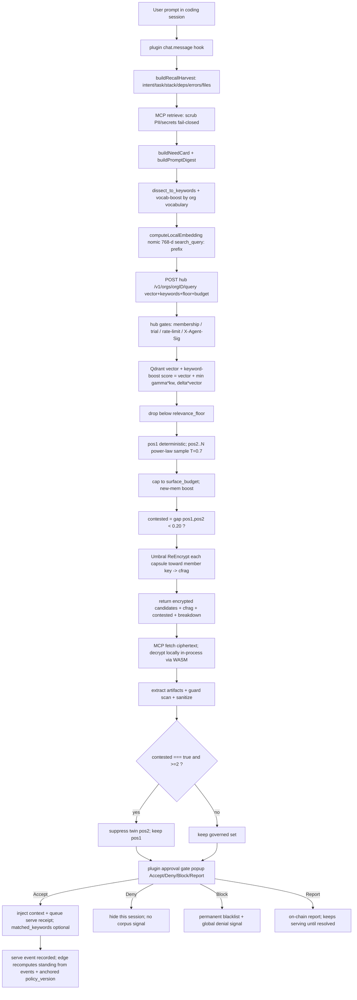

# WeVibe Recall System — Project-Wide Reference

> **Authority:** INDEX / REFERENCE only. This document **points to canon; it does not compete with it or become
> canon.** Where it summarizes a locked decision or a spec, the cited source (`DECISIONS.md`, `CANONICALUX.md`,
> `WP-DESIGN-SPEC.md`, `MATCHING_ENGINE.md`, chain/hub/mcp/plugin source) is authoritative. The source-ordering in §4
> is **this document's own operating policy for resolving conflicts, not a canon-locked rule** (no canon doc
> establishes it).
> **As-of:** 2026-07-15 (built from on-disk source + canon read that day). Recall is under active development;
> re-validate against code before relying on any file:line.
>
> **Audit certification (2026-07-16).** This document was subjected to a **claim-by-claim adversarial audit**: its
> body was mechanically extracted into **213 atomic claims (RC-001…RC-213)**, each assigned exactly once across five
> independent read-only audits and disproved-first against current source/config/canon. **All 213 were
> dispositioned.** Outcome: ~179 confirmed as written, 3 fully disproved, ~28 mixed/stale (a subpart wrong), and a
> few with subparts that are runtime-only or not-independently-verifiable in a read-only pass. Every disproved or
> stale statement was corrected here on 2026-07-16 and validated on-touch (R-29) against the live tree. **This is NOT
> a "100% runtime-certified" claim.** It certifies that each statement is now *honest and evidence-qualified* by the
> label below, distinguishing what was confirmed by reading current CODE, what is only observable at RUNTIME, what is
> durable HISTORICAL evidence, what is a known GAP, and what is a CANON assertion. Static confirmation ≠ a live
> end-to-end run; runtime subparts are labeled as such and were not re-exercised in this audit.
> **Freshness contract:** this is a snapshot. It is NOT auto-maintained. Treat every "CURRENT" claim as
> last-verified 2026-07-16 (audit pass) over the 2026-07-15 source read, and re-check on touch (R-29).
> **RB-1a update (2026-07-16).** The recall-floor calibration work of 2026-07-16 is folded in below (§6.3, §10 MM-9,
> §14, §19, §20): a reproducible 12-memory benchmark corpus + 23-case stable-slug gold + a tracked calibration
> harness now exist; an offline floor sweep was run; the live-agreement gate at a provisional 0.75 floor **FAILED**;
> root cause = the hub applies the floor *after* the freshness boost; and D-RECALL-GOVERNOR was clarified (the
> absolute floor gates the *pre-freshness* relevance score). Production floor remains **0.55** — no governor change
> shipped. These carry their own labels; the prior audit corrections are preserved, not reverted.
> **2026-07-25 update.** (1) **Floor conformance DONE 2026-07-16** (§6.3, §19): the hub now gates the floor on the
> pre-freshness score (server `401e7d6` + protocol `a43377b` + bench `2d12a44`; parity fixture extended to pipeline
> ORDER); the rebuilt-hub 0.75 live rerun scored pos 14/16 (matches sim) + empty 6/7 — raise criteria NOT met, so
> production stays 0.55 (the single empty leak = near-boundary embedding noise, not a gate defect). (2)
> **D-INJECTION-CADENCE-2026-07-24 ratified** (DECISIONS §23): inject ONCE at acceptance, bounded top-K token
> budget, verbatim compaction preservation, bench memory-block tokens metered separately — SUPERSEDES per-turn
> re-push; **MM-1 RESOLVED in the spec's direction** (code→spec; §6.1, §10, §19). (3) **Zero-progress extraction
> gate now BUILT in-product** (mcp `c5304d9` + bench clone `1a04bae`: resolved=0 ⇒ no LLM, zero memories,
> byte-compatible integrity record; fail-closed on segmentation error). (4) **Memory-side keyword-labeling gap +
> vector-only serve truth** recorded (§9, §19): extraction labels by build-tool not domain (8/17 corpus memories
> mislabeled) — root cause of the historical R0 vector-only serve 400 (D-C; now RESOLVED 2026-07-30 by pivot). (5) **D6 signed-auth port
> DONE** (canonical `/submit` + `/members`, mcp `3adb0de`; live once :4450 reloads). (6) Producer-model provenance
> now REACHES Qdrant for post-2026-07-24 commits (§9; bench `5394032` + hub `a171630`; first born-stamped 9/9).
> **2026-07-30 update.** The recall-pivot is **LIVE**. The chain now stores **EVENTS ONLY** — immutable,
> append-only, content-free, consumer-signed receipts; never verdicts, standing, weights, or scores. Standing is
> recomputed at the **edge** as `f(events, anchored policy_version)` under `edge-policy-v1` (hash
> `2d2faa14461aa51bb72735b05debf30defff039750e5f90c1922ae813c87899e`, anchored height 45; hub
> `status=anchor_verified`). The old per-keyword decay constants moved OUT of consensus as revisable **DRAFT
> VALUES** in the edge policy; the old per-keyword formula and `matched_keywords` serve gate left consensus. A serve
> with empty OR absent `matched_keywords` now returns **201** (live smoke), so the former vector-only serve 400 is
> resolved. Also live: MCP-edge + hub-intake memory-approval admission, D1+D3 serve-income-hold (pending until
> outcome or `serve_pending_window_epochs: 1440`, then unpaired serves are VOID and contribute nothing), and the Aw
> income fix (`worked_serve_quanta: 2`, worked-channel-only; a serve+worked pair credits TWO quanta). The 1440 window
> is a provisional production-tuned draft value, not a launch gate.
> **Scope:** the recall (retrieval → decrypt → gate → inject → attribute) path across the WeVibe system. Contribution
> and moderation appear only where recall depends on them.

**Status labels used throughout (never blurred):**

| Label | Meaning |
|---|---|
| **[LIVE]** | Built and running on the current stack (file:line cited); confirmed by reading current code. |
| **[STATIC-VERIFIED]** | Confirmed by reading current source in the 2026-07-16 audit, but NOT exercised at runtime here. |
| **[RUNTIME-OBSERVED]** | A behavior only provable by a live process/deploy; asserted from a prior live run or deploy, not statically. |
| **[HISTORICAL]** | A durable evidence result from a dated prior report/run; not a claim about the *current* live runtime. |
| **[TEST-ONLY]** | Exists only under `WEVIBE_RECALL_MODE=test` / benchmark, never on the prod shared-memory path. |
| **[LOCKED] / [CANON]** | A canonical/locked decision (`DECISIONS.md` / `CANONICALUX.md`) that binds the design. |
| **[INTENDED]** | Described by `WP-DESIGN-SPEC.md` as the target design; may not be built (see §D). |
| **[GAP]** | Depicted in canon/spec but NOT built, or built differently. From `GAPS-LOG-2026-07-10.md`. |
| **[FROZEN]** | Must not be changed without an explicit Walter-approved order (R-DECAY-FROZEN). |
| **[SEAM]** | A placeholder / inactive socket / field wired but disabled. |
| **[REC]** | Non-binding recommendation from this document's author (§E). Not a decision. |

---

## Table of Contents

1. Executive Overview
2. Glossary
3. Source-of-Truth Index
4. Source Precedence & Known Contradictions
5. End-to-End Recall Lifecycle (architecture + data flow)
6. Section A — CURRENT IMPLEMENTATION (by repo/service, file:line)
7. Section B — WP-DESIGN-SPEC INTENDED DESIGN
8. Section C — LOCKED / CANONICAL REQUIREMENTS
9. Section D — KNOWN GAPS / DEFERRED / UNBUILT
10. Current-vs-Intended Mismatch Register
11. Tuning-Lever Catalog
12. Trust / Security / Privacy Boundaries
13. Observability, Logging, Trace & Fingerprints
14. Test & Evaluation Matrix
15. Failure Modes & Troubleshooting
16. Worked Lifecycle Example (synthetic)
17. Deployment & Config Checklist
18. Change-Control Rules
19. Open Questions / Decision Forks
20. Section E — RECOMMENDATIONS (non-binding)
21. Appendix — Links & Paths

---

## 1. Executive Overview

**What recall is.** WeVibe recall is *organizational shared memory for coding agents, cryptographically
decentralized*. A developer's coding-agent plugin harvests live session signals, auto-queries an organization's
memory corpus, decrypts candidate memories **locally**, scans them, and presents each to the human through a
mandatory approval gate before any memory enters the agent's context. Nothing is "pulled" by the agent; the plugin
fires the query. The hub that coordinates retrieval **cannot decrypt** the memories it serves.

**The one-line invariant (product spine):** *Nothing enters an agent's context without human eyes on it first.*
(WP-DESIGN-SPEC Abstract §; DECISIONS D-RECALL-INJECTION-VISIBLE. Note: this exact invariant is asserted in
WP-DESIGN-SPEC and DECISIONS; it is **not** stated in CANONICALUX — CANONICALUX §0 carries the separate
D-MISSION-INVARIANT four-exit guarantee.)

**The path, in one breath.** Plugin harvests signals → builds a deterministic need-card → embeds it locally
(`nomic-embed-text:v1.5`, 768-d, via Ollama/LM Studio) → POSTs the query vector to the hub → hub does Qdrant
vector + keyword-boost scoring, drops below-floor candidates, samples positions 2..N probabilistically, caps to a
surface budget, flags near-ties as `contested`, and returns **encrypted** candidates + ranking/trust metadata →
plugin/MCP fetches ciphertext, has the hub re-encrypt each capsule toward the member's key (Umbral proxy
re-encryption — the hub's only crypto op, and it still cannot read plaintext), decrypts locally, runs wevibe-guard
+ sanitization, suppresses a contested twin deterministically, and renders the four-button approval gate
(**Accept / Deny / Block / Report**) → on Accept, injects the memory and queues an on-chain serve receipt.

**Who owns what.**
- **Plugin (`wevibe-opencode-plugin`)** — firing, harvest, gate, injection, serve relay, non-blocking discipline.
- **MCP client (`wevibe-mcp`)** — query build, local embedding, governor knobs, hub call, local decrypt, scrub,
  contested-twin suppression, artifact/guard checks.
- **Hub (`wevibe-server`, Go)** — Qdrant vector+keyword scoring, probabilistic ranking, relevance-floor +
  surface-budget governing, contested detection, Umbral re-encryption, serve/denial recording, recall
  observability. **Never a plaintext oracle.**
- **Chain (`wevibe-chain`, Cosmos SDK)** — authoritative encrypted memory state plus post-pivot immutable,
  append-only, content-free recall/serve outcome **events only**; never live standing/verdicts/weights/scores.
  It anchors org config (`vocab_hash`, `embedding_model_id`) and the edge policy (`policy_version` + hash), including
  `edge-policy-v1` at height 45 with hub `status=anchor_verified`; contributor-signed anchors and reputation remain
  separate chain records.
- **Umbral (`wevibe-umbral`, Rust)** — the `ReEncrypt` primitive (hub-side `wevibe-umbral:4460` container) and the local decrypt module, which runs in-process from WASM shipped inside `wevibe-mcp` (`vendor/umbral-wasm`) — no binary, no path, no env var.
- **Guard (`wevibe-guard`, Rust/YARA-X + regex)** — advisory sanitization at submit and at recall.

**Design vs reality, honestly.** `WP-DESIGN-SPEC.md` is written as **the alpha product as-if-shipped** — it
deliberately depicts several unbuilt capabilities as complete (Walter, Option B, 2026-07-10). The authoritative
built-vs-depicted ledger is `GAPS-LOG-2026-07-10.md`. This document keeps CURRENT (§A) and INTENDED (§B) strictly
separate and lists every gap in §D and every mismatch in §10.

## 2. Glossary

| Term | Meaning |
|---|---|
| **Memory** | One atomic technical insight. Four fields: `implement` (the fix), `context` (when it applies), `dnd` (do-not-do / negative knowledge), `stack` (technologies). |
| **Org (organization)** | A domain-expert-run, leader-curated memory collection you join. Recall queries one org per session. |
| **Leader** | Sole chain-publishing authority for an org; mints all kfrags; holds `K_master`. Memory **approval is leader-only** (`requireLeaderWallet`). |
| **Member / roles** | There is **no "Reviewer" role.** A member can submit + recall. Roles are freeform strings (used as `"leader"`/`"member"`) plus independent capability booleans `can_contribute` / `can_moderate` on the member record; there is **no `DenyMemory` handler** on-chain. |
| **Need-card** | Deterministic query-side card (Intent/Task/Language/Stack/Frameworks/Dependencies/Errors/Files) built from live session harvest. |
| **Retrieval card** | Deterministic doc-side card (`Applies when / Stack / Implement / Avoid`) embedded at approval. |
| **Prompt digest** | The intent+task prose actually embedded for the dense query vector (excludes identifier soup). |
| **Embedding** | `nomic-embed-text:v1.5` (768-d), same model both sides, prefixes `search_query:` / `search_document:`. |
| **Governor** | The relevance-floor + surface-budget + limit controls that turn a generous candidate set into a small, relevant, gate-ready set. |
| **relevance_floor** | Minimum combined score a candidate must clear to survive. Prod default 0.55. |
| **surface_budget** | Max number of governed candidates surfaced. Prod default 3. |
| **contested** | Hub flag: top-1 vs top-2 score gap < 0.20. Triggers deterministic twin-suppression client-side. |
| **Umbral PRE** | Proxy re-encryption over secp256k1: the hub re-addresses a sealed capsule toward a member's key without ever being able to open it. |
| **capsule / kfrag / cfrag** | capsule = sealed DEK envelope; kfrag = leader-minted re-encryption key; cfrag = hub's re-encrypted fragment the member's key opens. |
| **DEK** | Per-memory AES-256-GCM data-encryption key, sealed in the capsule. |
| **epoch_sk / umbral_pk** | Org epoch secret (derived leader-side, **never sent to the hub** on the active path) / its public key. `umbral_pk` lives in the **hub's Postgres epoch manifests** (fetched by the client from the hub), **not on-chain** — the chain persists no epoch/Umbral public key. |
| **Serve receipt** | Post-pivot content-free, consumer-signed event when a memory is Accepted; fires once per (session, memory). `matched_keywords` may be empty or absent and is no longer a serve-admission gate. |
| **Earned-Trust / standing (D-4.2, amended)** | **[LIVE pivot]** The chain stores events only. Standing = `f(events, anchored policy_version)`, recomputed deterministically at the edge under the published, hash-anchored policy (`edge-policy-v1`, hash `2d2faa14461aa51bb72735b05debf30defff039750e5f90c1922ae813c87899e`, anchored height 45; hub `status=anchor_verified`). The old chain-executed per-keyword decay formula is **[STALE pre-pivot record]**; its constants moved out of consensus as revisable draft values in the edge policy. |
| **Four-button gate** | Accept (inject + serve) / Deny (hide this session, no signal) / Block (permanent personal blacklist + global denial signal) / Report (on-chain accountability). |
| **WEVIBE_RECALL_MODE** | `prod` (default) or `test`. Test = floor 0 / budget 1000 / limit 1000 / throttles bypassed / auto-approve. |
| **GSTV** | Goal-Sealed Trajectory Verification: the pre-commitment receipt/tier mechanism (§8.12 of the spec) — DEPICTED, UNBUILT. |

---

## 3. Source-of-Truth Index

**Canon (authoritative; lazy-load these for design decisions — R-36):**
- `wevibe-docs/DECISIONS.md` *(gitignored-local)* — the locked-decision contract. All D-* IDs below live here.
- `CANONICALUX.md` *(workspace root — a **local, uncommitted** file; the workspace root is **not** a git repo, so
  "gitignored" doesn't apply here — it is local orchestration/UX canon)* — UX/product canon.
- `wevibe-docs/WP-DESIGN-SPEC.md` *(UNCOMMITTED/untracked as of 2026-07-15)* — the whitepaper design spec; the
  **intended** design (§B). Depicts gaps as complete by policy (see `GAPS-LOG` clause).
- `wevibe-docs/MATCHING_ENGINE.md` *(UNCOMMITTED-modified)* — the retrieval/ranking/governor architecture +
  tuning-parameter tables. The most recall-specific canon doc.
- `wevibe-docs/GAPS-LOG-2026-07-10.md` *(UNCOMMITTED/untracked)* — **CANON for whitepaper↔code reconciliation.**
  The authoritative built-vs-depicted ledger.
- `wevibe-docs/WHITEPAPER.md` — **DELETED in the working tree** (superseded by `WP-DESIGN-SPEC.md`). Do not cite.

**Code (the CURRENT implementation, §A):**
- `wevibe-mcp/src/retrieve-cli.ts` — recall client `retrieve()`; contested-twin suppression.
- `wevibe-mcp/src/config.ts`, `embedding.ts`, `embedding-config.ts`, `retrieval-card.ts`, `embed-card.ts`,
  `query-scrub.ts`, `org-client.ts`, `umbral.ts`, `http-server.ts` — client embedding/card/scrub/decrypt/route.
- `wevibe-server/wevibe-hub/internal/api/handlers/retrieval.go`, `internal/retrieval/{retrieval.go,ranking_core.go}`,
  `internal/config/config.go`, `internal/serves/serves.go`, `internal/umbral/service.go`,
  `internal/api/handlers/{keyword_extraction.go,recall_inspector.go}` — hub retrieval/scoring/serve/observability.
- `wevibe-opencode-plugin/plugins/{wevibe-plugin.ts,recall-harvest.ts}`, `tui/wevibe.tsx` — firing/gate/inject.
- `wevibe-chain/x/memory/keeper/lifecycle.go` + `x/memory/types/params.go` — **pre-pivot** Earned-Trust decay record;
  live standing is edge-policy computed from chain events.
- `wevibe-chain/x/{serve,org,reputation,attestation,bandwidth}/…` — settlement, anchors, sockets.

**Prior-work reports (institutional-memory KB, `wevibe-meta/workspace/reports/`):**
- `05-07-26-1223-recall-system-reference.md` — the prior canon-grounded recall reference (Jul-5; superseded by
  this doc on the prewarm point, otherwise still a good file:line map).
- `12-07-26-0810-contested-twin-suppression-mcp.md` — the D-RECALL-GOVERNOR pt5 change + its live verification.
- `04-07-26-1300-GAP-RECALL-HARVEST-and-query-scrub.md` — the harvest + scrub work.
- `wevibe-meta/workspace/docs/spec-recall-phase2.md` — deferred Track-A recall plan.
- `15-07-26-2141-recall-system-reference.md` — the report backing THIS document.

**Sim (ground-truth eval, not production):** `wevibe-sim/ranking-fix.js`, `wevibe-sim/recall-sim/` — the
recall-alignment simulator (Recall@k / MRR / nDCG; ranker↔chain parity fixtures).

## 4. Source Precedence & Known Contradictions

**Precedence order (highest first) when sources disagree.** *This ordering is **this document's own operating
policy** for reconciling conflicts — no canon doc (DECISIONS/CANONICALUX) establishes it, so it is **not**
`[LOCKED]`. It is a sensible working rule, not a canonical rule.*
1. **Locked decisions** — `DECISIONS.md` + `CANONICALUX.md`. These bind. (R-01, R-36.)
2. **Actual running code** — for *what the system does today* (§A), code is truth; a spec sentence never overrides
   observed behavior. On any code↔recorded-truth deviation, STOP-and-escalate (R-29).
3. **`GAPS-LOG-2026-07-10.md`** — authoritative for built-vs-depicted status.
4. **`MATCHING_ENGINE.md`** — authoritative for retrieval/ranking/governor mechanics + tuning defaults.
5. **`WP-DESIGN-SPEC.md`** — authoritative for the **intended** design and public wording, **but** by its own
   `GAPS-LOG` clause it intentionally depicts unbuilt work as shipped, so it is NOT a statement of current behavior.

**Known contradictions, stated explicitly with the governing source:**

- **"Injected once per session, not re-pushed every turn" (spec §2.5) vs per-turn injection (code).**
  WP-DESIGN-SPEC §2.5 says a recalled memory is "injected once per coding session … not re-pushed on every model
  turn." In code, the plugin's `system.transform` re-pushes the eligible memory block **every turn**
  (`wevibe-plugin.ts:1440-1447`); it is only the **serve attribution** that fires once per (session, memory)
  (`sessionInjectedCids`, `:1476`). This is a deliberate mechanism (OpenCode `system.transform` fires per turn;
  a per-session injected-set gates the serve, not the injection) documented in the session runbook. **Governing
  read:** the *product-visible* invariant (one serve per session, small governed volume) holds; the spec's
  "not re-pushed every turn" wording describes attribution/volume, not the literal system-prompt mechanic. Logged
  in §10 as MM-1. (No decision changes.)

- **"guarded by a permanent parity test vector" for epoch-key derivation (spec §4.2) vs reality.** Only a
  scalar→pubkey KAT exists; a full `epoch_sk` HKDF-drift KAT does not. Governed by `GAPS-LOG` **B1.6** [GAP].

- **OCR / ImageMagick / Tesseract sanitization (spec §4.7/§6.2 wording) vs text-only reality.** OCR is rejected;
  the suite is text-only. Governed by `GAPS-LOG` **B1.5 / B2.20** [GAP] (doc reworded; build is text-suite).

- **Report model (spec §7.5–§7.6 consumer-filed, plaintext-gated) vs chain reality.** On-chain `ReportMemory` is
  leader-signed only and writes plaintext on-chain ungated. Governed by `GAPS-LOG` **B1.1 / B1.2** [GAP].

- **`anticipated_need`** — deleted from canon 2026-07-04. Any doc/report still "awaiting ratification" on it is
  STALE. Governed by `DECISIONS.md` D-RECALL-ALIGNMENT.

- **Prewarm-at-load recall** — the Jul-5 reference flags a load-time recall defect. It has since been **REMOVED**
  from the plugin. Governed by current code (`wevibe-plugin.ts:1283-1297`). See §10 MM-2.

---

## 5. End-to-End Recall Lifecycle (architecture + data flow)

Recall is one leg of a three-stage loop (Contribute → Curate → Recall). This doc covers Recall; the two upstream
stages appear only as the source of the encrypted, indexed corpus recall reads.

### 5.1 Component & trust map

```
                 ┌──────────────────────────────────────────────────────────┐
                 │  wevibe-chain (Cosmos SDK)  — SOURCE OF TRUTH              │
                 │  encrypted memory blobs · content-free immutable events    │
                 │  policy_version/hash anchors · org/config anchors          │
                 │  Sees ciphertext, NEVER plaintext.                         │
                 └──────────────────────────────────────────────────────────┘
                             ▲ derived-from-chain           ▲ serve receipts / RPC
                             │                               │
                 ┌───────────────────────────┐               │
                 │  wevibe-hub (Go)           │               │
                 │  Qdrant vector+keyword     │               │
                 │  scoring · probabilistic   │   encrypted   │
                 │  ranking · governor · Umbral│  candidates + │
                 │  ReEncrypt · observability │   query vector │
                 │  DISPOSABLE. Never a       │◀──────────────┼───────────┐
                 │  plaintext oracle.         │               │           │
                 └───────────────────────────┘               │           │
                             ▲ ReEncrypt(capsule,kfrag)=cfrag             │
        ┌────────────────────┴───────────────────────────────────────────┴──────┐
        │  LOCAL MACHINE  (the ONLY place plaintext lives at recall)              │
        │  ┌────────────┐   ┌─────────────┐   ┌────────────┐  │
        │  │  Plugin    │──▶│  MCP client  │──▶│ wevibe-guard│ │
        │  │ (fire/gate/│   │ (embed/query/│   │ (sanitize)  │ │
        │  │  inject)   │◀──│  decrypt)    │   │             │ │
        │  └────────────┘   └─────────────┘   └────────────┘  │
        │  Ollama / LM Studio embedding endpoint (nomic-embed-text:v1.5, 768-d)  │
        └────────────────────────────────────────────────────────────────────────┘
```

### 5.2 The recall data flow (query → injection)



### 5.3 Ownership by lifecycle stage

| Stage | Owner | Key artifacts |
|---|---|---|
| **Ingestion / contribution** | dashboard + MCP + chain | Extract→Submit consent gates; per-memory DEK; commitment tx. |
| **Extraction** | MCP `/api/extract` (client model) | draft memories (`implement/context/dnd/stack`); LLM drafts, never gates. |
| **Normalization / dedup** | intra-batch exact-hash (MCP); leader near-dup 0.80 advisory (hub) | `extraction.ts` dedup; `keyword_extraction.go` near-dup probe. |
| **Supersession** | design-locked, **UNBUILT** | `supersedes_cid` (retrieval-only demote; MUST NOT set ARCHIVED). |
| **Embedding / index / storage** | MCP (embed doc-side) + hub Qdrant + chain (blob) | `nomic-embed-text:v1.5` 768-d; Qdrant per-org collection; chain encrypted blob. |
| **Query construction** | plugin harvest + MCP need-card | need-card, prompt-digest, keyword weights, vocab boost. |
| **Candidate retrieval** | hub Qdrant | vector + keyword candidate pull. |
| **Capability eligibility (admission; pre-scoring filter)** | hub | verify producer attestation, resolve producer tier from hub-materialized provenance + registry snapshot, drop producer-tier > consumer-tier (unknown relation fail-closed; exact-self only with proven identity). Runs before relevance-floor evaluation consumes the set; never contributes to scoring/ranking inputs (D-CAPABILITY-ELIGIBILITY design canonized 2026-07-23; implementation UNBUILT). |
| **Provenance admissibility (SERVING gate; two-tier)** | hub + receiving client | distinct from eligibility and from moderation/receipts: serve only with admissible provenance for BOTH producer-session and extraction-session legs, graded to pathway P1 `ATTESTED_EXECUTION` / P2 `PROVIDER_WITNESSED` (absence states never served; commit ≠ serveable). Hub pre-scan before ranking/gas-bearing work, then receiving-client final check before injection; client wins; unknown/missing/invalid fails closed (D-PROVENANCE-ADMISSIBILITY-2026-07-23 §22; UNBUILT). |
| **Filters / gates / governance** | hub (relevance_floor/surface_budget; membership/trial/rate-limit; memory-approval admission at intake) + MCP scrub + MCP-edge memory-approval admission | governor + auth gates on the capability-eligible set; unapproved memories fail admission before serving/intake. |
| **Scoring / ranking / rerank** | hub | weighted-sum score + ranking, then power-law sampler + contested flag. (Model rerank: deferred.) |
| **Decrypt / serve** | MCP (in-process WASM) + hub ReEncrypt | cfrag → local decrypt → DEK → AES-decrypt. |
| **User-facing behavior** | plugin + TUI | four-button gate, risk color, injection, toasts. |
| **Attribution / standing interface** | plugin serve relay → hub serves → chain events → edge policy | serve/outcome events; D1+D3 serve-income-hold until outcome or pending window; standing recomputed at the edge from events + anchored `policy_version`. |
| **Observability** | hub query_log/candidate_scores + per-op logs + traces | `/recall-health`, `[recall]`/`[inject]` logs, `X-WeVibe-Trace-Id`. |

---

## 6. Section A — CURRENT IMPLEMENTATION [LIVE unless noted]

Every claim here is file:line-grounded and on-touch-validated 2026-07-15.

### 6.1 Plugin — firing, harvest, gate, injection (`wevibe-opencode-plugin`)

- **Recall firing = per-prompt only.** `chat.message` → `triggerRecall` (`wevibe-plugin.ts:1325-1347`). Prompt
  text is read from `output.parts` (`:1330`), whitespace-normalized, deduped against `lastRecalledQuery`
  (`:1337`), gated on `wevibeAvailable` (`:1341`). `triggerRecall` (`:1181-1189`) hard-gates on
  `wevibeAvailable && bindingState.active`, dedupes on `recallInFlight`, and fires **fire-and-forget**
  `loadMemories(...)` (`:1188`) — never awaited (non-blocking invariant).
- **Prewarm-at-load recall = REMOVED** (positive drift vs Jul-5 reference). The load-time IIFE
  (`:1283-1297`) now does only `ensureWeVibeMcpRunning()` + `gcServedMemories()` + logging — **no recall fired at
  load, no generic query, no `session_id:"prewarm"`**. `"prewarm"` survives only as the fallback session-id label
  in `currentSessionId()` (`:416`). See §10 MM-2.
- **Harvest** (`recall-harvest.ts`): `buildRecallHarvest(signals)` (`:100-153`) → `intent` (regex `classifyIntent`
  `:72-98`), `task` (prompt capped 500), `stack`/`frameworks`/`deps`/`errorStrings`/`files` (dedup-capped).
  Signals gathered in `loadMemories` (`:972-982`) from `harvestProjectContext` (package.json/go.mod/Cargo.toml),
  `getRecentErrors`, `getEditedFiles`. **[SEAM]** `buildFailing`/`testFailing` are classified by `classifyIntent`
  and, per **D-FIXLOOP-RECALL** (Walter-locked 2026-07-22), MUST be populated from live session failure
  signals so repair-round recall queries carry actual failure evidence via the same deterministic need-card.
  Feed implementation is still pending (**[GAP]**).
- **Hub call:** `loadMemories` POSTs `${WEVIBE_MCP_HTTP}/v1/recall` (loopback `http://127.0.0.1:4450`, `:756`,
  `:986`). Body carries `query`, harvest fields, `org_id`, `mc_version:1`, `limit`, `session_id`,
  `relevance_floor`, `surface_budget` (`:993-1002`), Bearer token + `X-WeVibe-Trace-Id`. Timeout 10 s. In-memory
  cache TTL 5 min (`:700`, `:955`).
- **Injection semantics.** `experimental.chat.system.transform` (`:1349-1501`) runs **every turn**. It
  bounded-awaits `recallInFlight` (15 s cap `Promise.race`, `:1352-1366`), drains gate decisions, then builds a
  `memoryBlock` from **all eligible** approved-not-denied memories and pushes it to `output.system`
  (`:1440-1447`) — so the system-prompt block is **re-pushed per turn**. A per-session `sessionInjectedCids`
  Set (`:407`, `:1427-1428`) gates only the **serve relay** (once per (session, memory), `:1476`) and the
  `[inject]` log. Across compaction, `experimental.session.compacting` (`:1503-1512`) preserves the eligible
  block into `output.context`. **Net:** attribution is per-session; the injected system block is per-turn (§10 MM-1).
  **[CANON 2026-07-24 — D-INJECTION-CADENCE-2026-07-24, DECISIONS §23] the per-turn re-push is SUPERSEDED:** a
  recalled-and-accepted memory is injected ONCE at acceptance (stable early position immediately after system
  instructions), the served set is bounded (hub-ranked top-K within a fixed token budget), and the block is
  preserved VERBATIM across compaction by the hook (restore-verbatim, never summarize-through); benchmark arms
  meter the memory block's tokens separately from work tokens. JIT/reference-based progressive disclosure is
  PARKED as a future architecture seam. Implementation dispatched 2026-07-25 (plugin inject-once + verbatim
  preserve + bench metering; worker-image revendor before R2) — until it ships, the per-turn mechanic above is
  still the live code and this canon is the settled direction it must conform to (code→spec; resolves §10 MM-1).
- **Approval gate.** Blocking poll loop inside `transform` (`:1385-1403`): while undecided candidates exist and
  the TUI is live, poll every `250 ms` (`INJECT_GATE_POLL_INTERVAL_MS`) up to `300 s`
  (`INJECT_GATE_TIMEOUT_MS`), draining decisions each tick. `drainDecisions` (`:545-615`) reads the shared
  state-dir decisions file and applies Accept→`approvedCids`, Deny→`deniedCids`, Block→`deniedCids`+blacklist+
  `submitDenial`, Report→`reportedCids`+`submitReport`. Eligibility filter: `approved && !denied` (`:1413`).
- **Four-button gate + risk color** live in the TUI (`tui/wevibe.tsx`): Accept/Deny/Block/Report (`:600-619`);
  button order flips when guard-flagged (`:621-623`); risk color (`riskColorForEntry`, `:146-155`) = **red** if
  guard failed/flags present, **amber** if `score < 0.5` (`LOW_SIGNAL_THRESHOLD`), else **green**.
- **Content filter = partial.** Only the risk-appetite filter exists (`:1408-1416`): default `"neutral"` = no
  filter (full card served as-is); `"lowest"` = only `memory_type === "negative_signal"` pass. The **2×2 CONTENT
  axis is NOT built** (§D, GAPS-LOG B2.3). The full memory card is always served.
- **Serve attribution.** POST `/v1/serves` per newly-served memory (`:1482-1497`): body `org_id`, `memory_hash`,
  `nullifier`, optional `matched_keywords` (threaded from the recall response when present, `:1493`), `session_id`.
  Fire-and-forget; suppressed to local-only when `!bindingState.active`. Empty/absent `matched_keywords` is accepted
  post-pivot (201 smoke), so vector-only recalls are no longer silently unattributed by this field.
- **Test mode** (`WEVIBE_RECALL_MODE=test`, `:248-251`): auto-approve (skip popup) `:1105-1108`; a `TEST MODE`
  warning banner + toast. The `[inject]` logging (`:1430-1456`) is **NOT** test-only — it fires identically in
  prod; only the `TEST MODE` warning/toast are test-specific. **[TEST-ONLY]** (auto-approve/banner/toast).
- **Await discipline [LIVE, holds]:** the factory and `chat.message`/serve hooks never block on the network —
  recall fires fire-and-forget and serve fetches are fire-and-forget. **The one exception:** the `transform` hook
  **bounded-awaits** the in-flight recall promise (`recallInFlight`) via `Promise.race` with a **15 s cap**
  (`:1352-1366`) so a just-fired recall can land before the first turn — a bounded await, not an unbounded block.
  (This is the accurate form of the older "hooks never await network" wording, which overstated the invariant.)

### 6.2 MCP client — query build, embed, decrypt, governor (`wevibe-mcp`)

- **`retrieve()`** (`retrieve-cli.ts:267`) is the single **live** recall chokepoint: the HTTP `/v1/recall` route
  (`http-server.ts:328`) is the only caller that reaches it. The declared CLI/bin leg (`wevibe-retrieve`,
  `package.json`) is **vestigial** — there is no CLI `main` and the bin never invokes `retrieve()`. So it is a
  single-implementation function reached by ONE live path (HTTP), with a dead CLI shim beside it — not a
  ONE-PATH shared by two working entrypoints. Flow: init crypto → `ensureIdentity` → `loadMemberships` (graceful empty
  `no_membership` if none, `:291-304`) → resolve org → **scrub** → harvest → need-card + prompt-digest →
  keywords (graceful `no_keywords` empty, `:340-349`) → embed → vocab-boost → hub query → per-memory decrypt →
  contested-twin suppression → output.
- **Embedding.** `EMBEDDING_MODEL` default `nomic-embed-text:v1.5` (`config.ts:95`, env
  `WEVIBE_EMBEDDING_MODEL`). Prefixes `search_query: ` / `search_document: ` (`config.ts:96-97`).
  `loadEmbeddingConfig` (`embedding-config.ts:86`) resolves provider/model from `~/.config/wevibe/dashboard.json`
  and auto-enables prefixing only when the model name contains `nomic` (`:121`). `computeLocalEmbedding`
  (`embedding.ts:24`) POSTs `{model, input: prefix+text}` to the `/embeddings` endpoint (default
  `http://127.0.0.1:1234/v1`, LM Studio), 3 attempts, retry on 429/≥500. **768-d is implicit** in the model —
  no hardcoded dimension client-side.
- **Cards (deterministic, no LLM).** `buildRetrievalCard` (doc side, `retrieval-card.ts:44`),
  `buildNeedCard` (query side, `:84`), `buildPromptDigest` (the prose actually embedded, `:110`).
  `buildAnticipatedNeed` is **gone** from MCP (lives only in `wevibe-sim`) — matches the D-RECALL-ALIGNMENT
  deletion.
- **Scrub [LIVE, fail-closed].** `scrubQueryHarvestInput` (`query-scrub.ts:110`) redacts PEM keys, JWTs, AWS/GitHub/
  Slack tokens, bearer tokens, secret assignments, long hex/base64, emails, absolute paths; any throw →
  `<redacted>` and a minimal object keeping only non-content scalars. Choke point: `retrieve-cli.ts:318`, before
  everything downstream.
- **Governor knobs sent by the client.** `RECALL_MODE_GOVERNORS` (`retrieve-cli.ts:85`): **prod** =
  `{relevance_floor 0.55, surface_budget 3, recall_limit 3}`; **test** = `{0, 1000, 1000}`. Mode from process env
  `WEVIBE_RECALL_MODE` (`:99`). Per-request override wins (`scrubbedInput.X ?? governor.X`). The HTTP layer
  applies the same governor as default when the body omits a field (`http-server.ts:285-303`).
- **Recall HTTP route.** `POST /v1/recall` → `handleRecall` (`http-server.ts:277`, registered `:1696`). Inbound
  auth = **Bearer session-token only** (`authorize`, `:118-126`). Runs guard per memory (`:380-390`) and provider
  policy before returning. (The `X-Agent-Signature` Ed25519 header is used **outbound** on the client→hub query,
  `org-client.ts:165`, not on this inbound route.)
- **Decrypt.** `decryptMemoryBlob` (`org-client.ts:506`): fetch receiving-sk + delegating-pk
  (`getEpochUmbralPk`) → `umbralDecryptReencrypted` (`umbral.ts`, in-process WASM — no binary, no env var) → DEK
  (validated 32 bytes) → `decryptSymmetric`. Ciphertext fetched with fallback `ciphertext_hex ?? encrypted_blob`
  (`retrieve-cli.ts:454`). The receiving-sk / delegating-pk are the client's registered PRE keypair and the
  hub-served `umbral_pk` — see §12; all logs are fingerprints + sizes only — never raw secrets.
- **Contested-twin suppression [LIVE]** (D-RECALL-GOVERNOR pt5, `retrieve-cli.ts:530-552`): when hub
  `contested === true && memories.length >= 2`, keep `memories[0]`, `splice(1,1)` the near-tied twin, positions 3+
  untouched. Deterministic, no re-rank, no LLM (R-33-safe). Logs `[recall] contested-twin-suppression` + structured
  `recall.suppress` op. **[HISTORICAL]** Live-verified against the real transport at report `12-07-26-0810` (a
  dated result, not current-runtime certification): hub returned 2 → surfaced 1 on a 0.0327 gap; a 0.4433-gap
  control returned 2 unchanged.

### 6.3 Hub — scoring, ranking, governor, contested (`wevibe-server/wevibe-hub`)

- **Recall route.** `POST /v1/orgs/{orgID}/query` → `QueryMemories` (`internal/api/handlers/retrieval.go:30`).
  (Note: the handler reads `org_id` from the JSON **body**, not the URL param.) Gates in order:
  X-Agent-Signature Ed25519 verify over the raw body (`:46-90`, 401 on mismatch); membership (`403 not_a_member`,
  `:133-136`); trial (expiry + daily limit, default `5`/day, `403 trial_*`, `:140-171`); non-trial inactive
  (`403 membership_inactive`, `:173-179`); rate-limit (per-org `org_recall_rate_limits`, `429`, fail-open on error,
  `:181-209`).
- **Scoring = weighted sum, NOT RRF.** `ScoreAndRank` (`ranking_core.go:162`):
  `final = vector_score + min(γ·keyword_boost, δ·vector_score)` (`:187-195`), then pending-denial penalty
  (`− pendingDenials·0.05`, `:197-199`) and new-mem boost (`:201-208`). Constants **γ = 0.1** (`keywordBoostFactor`,
  `retrieval.go:478`), **δ = 0.15** (`keywordBoostDelta`, `:479`). These are caller-passed tuning defaults, not
  internal `ScoreAndRank` defaults.
- **Probabilistic sampler (D-9.4).** `probabilisticRank` (`retrieval.go:97-187`): position-1 strict top-1
  (deterministic); positions 2..N tempered power-law `w_i = (score_i/max_score)^(1/T)`, sampled without
  replacement. Env: `RETRIEVAL_TEMPERATURE` 0.7, `RETRIEVAL_NEW_MEM_BOOST_MULT` 0.5,
  `RETRIEVAL_NEW_MEM_BOOST_WINDOW` 30 (`config.go:68-70`; wired `main.go:45-52`). `GraceEpochs = 20` hardcoded
  (`main.go:49`); effective new-mem window = 50 epochs.
- **Governor.** `relevance_floor` + `surface_budget` are **per-request, client-sent**, applied **before** the
  sampler (`retrieval.go:733-751`): floor drops below-threshold candidates, budget caps the sampler limit. `limit`
  server default = **3 prod / 1000 test**, only when the client omits it (`:120-126`). The hub does **not** hardcode
  0.55 or 3 — those are client-side prod defaults.
  - **Floor gates the PRE-FRESHNESS score — conformance FIXED 2026-07-16 [LIVE].** The floor was formerly compared
    against `sr.weightedScore = row.Final` (`retrieval.go:733-741`), which already included the D-9.4 new-memory
    freshness boost (`ranking_core.go:201-208`, `final × (1 + 0.5·fraction)` — a flat ×1.5 at age 0) — a freshly-seeded
    corpus inflated every score (`combined/vector ≈ 1.516` at age 0) and effectively disabled the floor (root cause of
    the RB-1a live-gate failure, §10 MM-9). **D-RECALL-GOVERNOR was clarified 2026-07-16 [LOCKED]:** the absolute floor
    must gate the **pre-freshness** semantic-relevance score (D-9.3 `vector + capped keyword boost`); freshness may
    order the admitted set but never decide admission. **The conformance fix SHIPPED the same day:** the hub now gates
    the pre-freshness D-9.3 combined score inside `ScoreAndRank` (freshness orders admitted candidates only;
    not touching chain standing policy — server `401e7d6` + protocol `a43377b` + bench `2d12a44`), and the Go↔JS parity fixture now
    proves floor-before-freshness pipeline ORDER (3 consumers green: Go + JS parity + sim check-parity). The rebuilt,
    redeployed hub reran the authorized 0.75 live gate through the real transport (R-37 op-log `hub.recall_floor_gate`
    verified the rebuilt binary served): **pos 14/16 (now matches sim) + empty 6/7** (vs buggy 16/16 + 0/7) → the raise
    criteria (pos 13–15 AND empty 7/7) were NOT met, so **production stays 0.55**. The one remaining empty leak was
    diagnosed as near-boundary noise (leaking case pre-freshness final 0.7384 < 0.75 offline ground truth; 22/23
    live↔offline agree; the live cross came from ~0.012 embedding run-to-run variance), not a gate defect — no
    fixture/floor/code change followed.
- **Contested detection.** `const contestedThreshold = 0.20` **hardcoded** (`retrieval.go:43`); if top-1 minus
  top-2 gap < 0.20 (and ≥ 0), returns `contested = true` (`:798-804`). Not env-configurable — changing it needs a
  code change + rebuild.
- **Serve/denial.** `POST /v1/orgs/{orgID}/serves` → `RecordServeEvent` (`serves.go:28`) → `RecordServe`
  (`:106`). **Pivot update 2026-07-30 [LIVE]:** `matched_keywords` is no longer a serve-admission gate; live smoke
  proves empty OR absent `matched_keywords` returns **201**. Session dedup: `session_served_memories (org_id,
  session_id, memory_cid)` upsert + 24 h sweep (`:183-190`); the recall handler also subtracts already-served CIDs
  in the last 24 h (`retrieval.go:242-265`). D1+D3 serve-income-hold is live: serve income is held pending an
  outcome or the edge-policy `serve_pending_window_epochs: 1440`; unpaired serves past that window are VOID and
  contribute nothing. The 1440 value is a provisional draft value to tune from production outcome-lag data, not a
  launch gate.
- **Memory-approval admission [LIVE, 2026-07-30].** Admission now exists at both the MCP edge and hub intake: only
  approved memories are allowed through the production recall/intake path. This is the product enforcement of the
  human-approval spine, separate from ranking and from economic settlement.
- **Policy anchoring [LIVE, 2026-07-30].** Hub reports `status=anchor_verified` for `edge-policy-v1`; hash
  `2d2faa14461aa51bb72735b05debf30defff039750e5f90c1922ae813c87899e` is anchored on-chain at height 45. Standing
  and income rules consume the anchored `policy_version`; they are not chain-executed formulas.
- **Umbral ReEncrypt.** `ReEncryptForMember` (`internal/umbral/service.go:56`), called per candidate at
  `retrieval.go:389`. **A ReEncrypt failure does NOT drop the memory** — the CID is returned in
  `RequiresReencryption` without a cfrag (`:390-395`); the client re-requests. The hub reaches the Umbral sidecar
  over the Docker network at `wevibe-umbral:4460` — an **internal container port, not a host `127.0.0.1:4460`
  listener** (the `wevibe-umbral` service publishes no host port; see §17).
- **Near-dup (leader curation only, NOT recall).** `nearDupFloor = 0.80` (`keyword_extraction.go:106`), used by
  `NearestExistingMemories` in the submission/keyword path — the recall path never calls it. **[SEAM/stale-cal]**
  the `>= 0.84` duplicate signal is a **stale-model comment** (`:102-104`): calibrated on the prior 4×-dimension
  model, pending re-validation for nomic-768; not a live recall constant.
- **Observability [LIVE].** Per recall query, the hub persists `query_log` + `query_candidate_scores`
  (`internal/retrieval/querylog.go`; fire-and-forget goroutine, 3 s timeout) with each candidate tagged
  `returned`/`below_floor`/`over_budget_unsampled`. Leader-only `GET /v1/orgs/{orgID}/recall-health`
  (`recall_inspector.go:317`) aggregates floor fidelity, restraint, zero-injection %, contested %, serve:denial,
  disposition bars; `GET …/recall-queries[/{id}]` drills into individual queries.

### 6.4 Chain — events and anchors (`wevibe-chain`)

- **Recall pivot [LIVE, 2026-07-30].** Chain live behavior is now event storage and anchoring only: immutable,
  append-only, content-free, consumer-signed events plus anchored `policy_version`/hash. It never computes or stores
  live standing, verdicts, weights, or scores. Standing is recomputed at the edge as `f(events, anchored
  policy_version)` under `edge-policy-v1` (hash
  `2d2faa14461aa51bb72735b05debf30defff039750e5f90c1922ae813c87899e`, anchored height 45; hub
  `status=anchor_verified`). Canon source: `DECISIONS.md` D-4.2 joint-amendment banner and D1 ratified amendment.
- **Earned-Trust decay (D-4.2) [STALE pre-pivot record; formerly LIVE/FROZEN].** Historical chain-executed behavior:
  `applyDecay` (`x/memory/keeper/lifecycle.go:128`), params in BPS in `x/memory/types/params.go:6-18`, verified in
  the pre-pivot audit to match then-current `MATCHING_ENGINE.md`: serveD 220, denialD 900,
  idleD 600, grace 20, trustMinServes 1, trustMaxRate 3000bps(0.30), serveFloor 4000bps(0.4), denialFloor
  3000bps(0.3), idleProtect 500bps(0.05), idleUntrusted 10000bps(1.0), retrievalThreshold 1500bps. Archive when
  **every** keyword weight ≤ 1500 bps (`:199-212`). The primary discriminator is `denial_rate`, **but** trust is
  earned only when BOTH a raw serve floor and the rate hold: `ServeCountTotal >= trustMinServes` (i.e. ≥ 1) **and**
  `denialRate < trustMaxRate` (`lifecycle.go:150-151`) — so a raw serve count does gate trust, alongside the rate.
  Per-keyword `matchedThisEpoch` gate (`:163-178`); historical serve/denial with empty matched-keywords rejection
  (`:322-324`, `:350-352`). **This no longer describes live standing behavior.** The constants migrated out of
  consensus as revisable draft values in the edge policy and are no longer frozen chain law.
- **matched_keywords [STALE as gate; field may remain historical metadata].** `StoredServeReceipt.MatchedKeywords`
  (`x/serve/types/state.pb.go:35`) exists as schema/history, but empty or absent `matched_keywords` is accepted in
  the live serve path (201 by smoke) and no longer gates attribution. Lifetime totals on `StoredMemoryCommitment`
  (`x/memory/types/state.pb.go:323-324`) are historical chain metadata, not live standing.
- **Org-config anchors [LIVE].** `StoredOrgConfig.VocabHash` + `.EmbeddingModelId`
  (`x/org/types/state.pb.go:389-390`), set by `MsgSetOrgConfig`. Anchored **per org, one pin** — NOT on the
  per-memory `MsgSubmitCommitment` (D-HUB-REBUILDABLE).
- **Contributor-signed anchor (§7.4) [LIVE].** `plaintext_hash` / `salt` / `ciphertext_hash` / `contributor_sig`
  ride on `MsgApproveMemory`, persisted to `StoredMemoryCommitment` (`state.pb.go:318-322`), signature verified in
  `ApproveMemory` (`msg_server.go:144`). (These signed-anchor fields are **not** on the initial
  `MsgSubmitCommitment`, which carries its own set — `org_id`, `content_hash`, `keywords`, `contributor_id`,
  `contributor_wallet`, `memory_type`, `mc_version` — i.e. multiple fields, just not the contributor-signed anchor.)

### 6.5 Umbral sidecar (`wevibe-umbral`, Rust)

The confidentiality core. RPCs: `StoreKFrag`, `ReEncrypt`, `DeleteKFrags`, `DeleteOrgKFrags`, `Health`. There is
**no encrypt / generate-kfrags RPC** — kfrag generation is a leader-side CLI dev tool; the hub only ever *applies*
leader-minted kfrags. The sidecar's `ReEncrypt` (`service.rs:40`) **delegates the actual re-encryption math to the
external `umbral-pre` crate** (`Cargo.toml`, v0.11; `use umbral_pre::reencrypt`, `service.rs:8,103`) — this repo
itself implements only orchestration + (de)serialization (`crypto.rs`), not the primitive. What the repository
therefore *proves* is the PRE **security boundary / data flow**: the hub holds only kfrags and a capsule and can
**never recover the DEK** (it lacks the member's secret scalar `b`; the client multiplies by `b` locally). The
exact re-encryption relation (conceptually `cfrag = rk·(E+V)`) is defined by the `umbral-pre` crate, not hand-rolled here.

### 6.6 Production vs test behavior

| Aspect | Prod (`WEVIBE_RECALL_MODE` unset/`prod`) | Test (`=test`) |
|---|---|---|
| relevance_floor | 0.55 (client) | 0 |
| surface_budget | 3 | 1000 |
| recall limit | 3 | 1000 |
| Human gate | **Mandatory** blocking popup | **Auto-approve** (popup skipped) |
| Trial daily / rate-limit throttles | Enforced (hub) | Bypassed (trial *expiry* still enforced) |
| Earned-Trust auto-accept | Persisted approvals honored | Disabled — every candidate re-gated/re-counted |
| Observability | `[recall]` + `[inject]` logs | same logs **plus** a `TEST MODE` warning banner + toast (the `[inject]` lines are NOT test-only — they fire in prod too) |

`WEVIBE_RECALL_MODE` is read **independently** by plugin, MCP, and hub (D-RECALL-MODE-FLAG). Test mode is for
benchmarking/dev only and is **outside the shared-memory safety contract** (WP-DESIGN-SPEC §5.2). Never enable it
for production shared/org recall.

---

## 7. Section B — WP-DESIGN-SPEC INTENDED DESIGN [INTENDED]

Source: `wevibe-docs/WP-DESIGN-SPEC.md` (2026-07, "Architecture & Design Specification"). It is written as the
**alpha product as-if-shipped**; several items below are depicted complete but are unbuilt (see §D). Section
numbers are the spec's own.

- **§1–§2 Frame.** Recall is one stage of Contribute→Curate→Recall. The six trust questions (authenticity,
  correctness, safety, confidentiality, permanence, sovereignty) structure the whole spec; recall touches all six.
  The **No-Blind-Injection** requirement is non-negotiable: every recalled memory passes human eyes first (§2.5).
- **§2.5 Human-in-the-loop gate.** During a session the plugin harvests local signals, auto-queries org memory,
  decrypts candidates locally, scans with wevibe-guard, and presents the **four-button gate** (Accept/Deny/Block/
  Report, Table 3). Two properties: *no plugin = no injection path*; and injection is *per session, not per turn*
  with a relevance floor + surface budget keeping volume small. (On the per-turn nuance vs code, see §10 MM-1.)
- **§4.5 Hub confidentiality.** The narrow claim: the hub **cannot decrypt** memory ciphertext under Umbral PRE
  (CODE 5 gives the secp256k1 re-encryption relation). The honest boundary: the hub is **not** zero-knowledge —
  it holds clean float32 embeddings + plaintext keyword weights in Qdrant, a "disclosed, lossy, realistically-
  invertible semantic shadow." Mitigations are operational (API auth, loopback-only port binding, per-org
  collection isolation, signed responses), not cryptographic. "Cannot decrypt" ≠ "learns nothing."
- **§4.7 Sanitization pipeline (twice).** Submit-time steps 1–5 (guard scan, text-sanitization suite, encryption,
  human review, on-chain submission) and recall-time steps 6–14 (hub candidate query, ciphertext fetch + local
  decrypt, blacklist filter, guard scan, text sanitization, artifact extraction + egress flagging, plugin gate,
  serve receipt, context injection). Table 10 lists what it catches (mechanical injections, credentials, Unicode
  steganography, URLs/IPs, dependency/config/shell attacks) vs cannot (semantic prose, plausible-but-wrong).
- **§5 Retrieval & recall.** Situation-centric card + deterministic need-card, symmetric `nomic-embed-text`
  embedding with matched prefixes. **CODE 6 scoring:** `final = vector + min(γ·keyword_boost, δ·vector)`, defaults
  γ=0.1, δ=0.15 — explicitly "tuning defaults, not protocol constants." **Contested handling:** deterministic
  twin-suppression is the shipped default; a model-based rerank is "optional, deferred, not part of the shipped
  path." §5.2 Diagram 3 shows the auto-query, plugin-gated flow with a benchmark/test auto-approve note explicitly
  *outside* the shared-memory contract.
- **§6 Local architecture.** MCP server + plugin (in-process Umbral WASM), wevibe-guard. Recall-side local
  responsibilities: harvest → embed via Ollama → send vector + filters to hub → fetch ciphertext → decrypt
  in-process → guard → gate → inject. Clients do not download full corpora. §6.7 chain-resolved hub endpoints
  (untrusted transport, signature-verified responses).
- **§7 Review & accountability.** Pre-commit lifecycle `pending_keyword → pending_chain → committed` (+ terminal
  `denied`), leader sole signer. §7.4 contributor-signed anchor (`plaintext_hash`, `salt`, `ciphertext_hash`
  jointly signed). §7.5–§7.7 the report model: file (no reveal) → one-week window → uphold/dismiss → gated public
  plaintext reveal on lapse/dismiss, anchored to the contributor hash; no platform tribunal.
- **§8 Provenance & reputation.** Reputation is provenance made visible; serve attribution is a **social signal,
  not economic** (decoupled from payout). Two keys per user: `global_contributor_key` + per-org `org_serve_key`.
  §8.11 the honest boundary: signatures prove *who submitted/curated*, not that the session occurred.
- **§8.12 Goal-Sealed Trajectory Verification (GSTV) [INTENDED, UNBUILT].** Pre-work goal seal (goal +
  executable predicate + `state_0` hash, contributor-signed/timestamped), cross-session trajectory hash chain,
  three receipt types (predicate/ablation/negative), per-memory tiers T0–T4. **Tiers are labels at the gate, never
  a contribution gate, and do not enter retrieval scoring.** Depicted complete; entirely unbuilt (§D).
- **§9 Storage.** Encrypted memory on-chain (500 B–2 KB typical); keyword weights on-chain metadata; embeddings
  hub-side Qdrant, rebuildable from chain + org keys. §9.4 lists the per-memory metadata record (including the
  report/quarantine flags + `verification_tier`/`receipt_refs` that are currently absent on-chain — §D).
- **§10–§11 Security & decentralization.** Capture is made economically unsustainable via transparent on-chain
  accountability, frictionless exit, and a suppression-proof escalation primitive. Eight custom Cosmos modules
  (`x/org`, `x/memory`, `x/serve`, `x/identity`, `x/reputation`, `x/emissions`, `x/bandwidth`, `x/attestation`);
  `x/attestation` is an inactive socket in current scope.

---

## 8. Section C — LOCKED / CANONICAL REQUIREMENTS [LOCKED]

Verbatim binding rules live in `DECISIONS.md` / `CANONICALUX.md`; these are the recall-relevant ones. Map every
change to a flow + rationale (R-01). Do NOT re-open these without Walter (R-36).

- **D-MISSION-INVARIANT** — four enforceable guarantees: no single party may unilaterally READ plaintext, WITHHOLD
  function, REWRITE the record, or KILL an org's knowledge. Operationally: hub never receives `epoch_sk`/DEK/
  plaintext; content-free always.
- **D-RECALL-ALIGNMENT** (amended 2026-06-19 + 2026-07-04) — situation-centric doc card + deterministic need-card;
  **asymmetric role-specific prefixes** `search_document:` (doc side) / `search_query:` (query side) on the **same**
  pinned model (not symmetric strings — the two roles use different prefixes by design); **canonical embedding =
  local `nomic-embed-text:v1.5` (768-d)**, same pinned model both sides; keyword boost, never a gate;
  `anticipated_need` **DELETED** (card pure-deterministic both sides). Boost formula
  `final = semantic_cosine + min(δ, γ·keyword_similarity)`.
- **D-RECALL-GOVERNOR** (Walter-locked 2026-06-18; thin-client/fat-backend shipped 06-19) — governing lives in the
  hub. Absolute relevance floor (default 0.55, client-sent, zero-injection is healthy); trust the hub score (no
  substring re-rank); δ-cap the keyword boost; surface budget (default 3); **pt5 contested-twin suppression**
  (consume the hub `contested` flag deterministically, no LLM). LIVE. **Clarified + CONFORMED 2026-07-16:** the
  absolute floor gates the **pre-freshness** relevance score; freshness orders admitted candidates only. The hub's
  former post-freshness gate (`row.Final`) was a conformance bug — FIXED same-day (§6.3; server `401e7d6` +
  protocol `a43377b` + bench `2d12a44`; parity fixture extended to pipeline order). The 0.75 live rerun on the
  rebuilt hub missed the raise criteria (pos 14/16 + empty 6/7), so production floor stays 0.55 (§10 MM-9).
- **D-RECALL-MODE-FLAG** — `WEVIBE_RECALL_MODE ∈ {prod,test}` read independently by plugin/MCP/hub. Test = floor 0
  / budget 1000 / limit 1000 / throttles bypassed / auto-approve / `[inject]` observability / no persisted
  auto-accept. Amends D-SESSION-SERVE-DEDUP (uses OpenCode's real session id; serve once per session).
- **D-RECALL-INJECTION-VISIBLE** — no memory is injected the user cannot see; approval popup is the canonical
  surfacing surface; risk color-coded (green/amber/red); hidden-injection with no visible trail disallowed.
- **D-RECALL-CONSUMER-MATRIX-2×2** — content `[Implementations+DNDs | DNDs only]` × gate `[Gated | No-gate]`,
  default All + Gated. (Content axis unbuilt — §D B2.3.) Guard behavior: a guard **FAILURE** blocks (the memory is
  held for review) in every mode; in **prod**, a guard **flag** also forces the memory through the human popup. In
  **test mode**, however, a guard-*passed-but-flagged* memory is auto-approved and injected with no popup — so the
  guard override is **not** "non-defeatable in all modes." That is consistent with test mode being **outside the
  shared-memory safety contract** (WP §5.2 / D-RECALL-MODE-FLAG), never a prod path.
- **D-RECALL-FEEDBACK-FOUR-BUTTON** — Accept (serve+) / Deny (neutral, context≠quality) / Block (permanent
  personal blacklist + global denial) / Report (on-chain accountability). Block is the load-bearing negative path;
  Deny emits no corpus signal.
- **D-MEMBER-CAPABILITIES** — recall enablement gated **solely** on `membership_active`, per-member, hub-only;
  never coupled to `can_contribute`. Roles {leader, member} with independent capability bools.
- **D-HUB-REBUILDABLE** — a replacement hub reconstructible from chain + org keys alone; rebuildability = top-k
  parity, not bit-identity; requires `vocab_hash` + `embedding_model_id` on-chain. (Rebuild tooling unbuilt —
  GAP-MI-3.x.)
- **D-SUPERSESSION-DEMOTE** (design-locked 2026-07-04, NOT built) — retrieval-only demotion via `supersedes_cid`;
  **HARD CONSTRAINT: MUST NOT set MemoryState = ARCHIVED** (historically D-4.2's exclusively; post-pivot, do not
  create any new chain-side standing/archive writer).
- **D-4.2 Earned-Trust / standing [LIVE pivot, amended 2026-07-30]** — chain stores events only: immutable,
  append-only, content-free, consumer-signed; never verdicts, standing, weights, or scores. Standing = `f(events,
  anchored policy_version)`, recomputed at the edge under the versioned policy. SoT is
  `wevibe-server/wevibe-hub/policy/edge-policy-v1.json`; hash
  `2d2faa14461aa51bb72735b05debf30defff039750e5f90c1922ae813c87899e` is anchored on-chain at height 45 and the hub
  reports `status=anchor_verified`. The old per-keyword chain formula/weights/`matched_keywords` serve gate left
  consensus; old constants are revisable draft values in the edge policy, not frozen chain law. Canon: DECISIONS.md
  D-4.2 joint-amendment banner + D1 ratified amendment.
- **D-PLAINTEXT-IRREVOCABLE** (2026-07-07) — served plaintext is permanently disclosed to that participant; no
  revocation/DRM/remote-wipe tooling ever; security budget goes to the admission edge + serve edge. Does not
  weaken hub-cannot-read.
- **D-PERSONAL-MEMORY** — personal memory is a bounded local pull layer, outside the chain-rebuildable contract;
  Stage-1 = CodeGraph code-nav (NOT in recall/security path).
- **D-MODERATION-ADVISORY / D-KEYWORD-AT-EXTRACTION / D-5.7 / D-5.8** — moderation always-on advisory (leader sole
  authority); keywords at extraction, curated by leader at batch, vocab-join at commit; contribution fully manual
  (Extract then Submit); recall query auto, injection gated, no agent `wevibe_recall` tool.
- **D-FIXLOOP-RECALL** (Walter-locked 2026-07-22) — repair-round recall is first-class: `buildFailing`/
  `testFailing` (§6.1 seam) MUST be fed from live failure signals; fix-loop recall uses the same deterministic
  need-card with actual evidence, no per-recall LLM, and one shared product+benchmark path. **[GAP]** until built.
- **D-SESSION-SUBSTRATE / D-FAILURE-EPISODES** (Walter-locked 2026-07-22) — extraction substrate is the full local
  session event stream (messages incl. repair/feedback, assistant text, tool calls+outputs, file edits) via one
  byte-identical builder shared production↔benchmark; deterministic code-only episode segmentation (failing signal →
  edits → resolved/unresolved) grounds symptom→diff→validation spans and DND-only unresolved candidates; E2
  evidence-bounding stays unchanged. **[INTENDED] / [GAP]** until built.
- **D-ATOMIC-CONFORMANCE** (Walter-locked 2026-07-22) — one insight = one memory object end-to-end, including
  benchmark harnesses; blob-merging multiple insights into one object is a canon violation (reaffirms §5.1 /
  D-MEMORY-OBJECT-IMPLEMENT-DND).
- **D-EXTRACT-ORG-AUTORESOLVE** (Walter-locked 2026-07-22) — `/api/extract` with no explicit org auto-resolves the
  contributor's active org from submit-time context; explicit `settings.org_id` wins. **[GAP]** until dashboard
  caller ships.
- **D-BENCH-INTEGRITY** (Walter-locked 2026-07-22) — benchmark policy: `BUDGET_STOP` is not capability FAIL; one
  cost meter + correct statistics; budget-bounded attempt caps (fail-to-fix data remains valid memory input);
  substrate/pool changes require a fresh pre-registered baseline.

---

## 9. Section D — KNOWN GAPS / DEFERRED / UNBUILT [GAP]

Authoritative ledger: `GAPS-LOG-2026-07-10.md` (its clause: the whitepaper depicts these complete on purpose;
they close by **building**, not by softening the doc). All chain-side statuses below were on-touch re-verified
2026-07-15 and MATCH the GAPS-LOG. **None represents a deviation between recorded truth and reality** — the gaps
are honestly logged.

**Recall-affecting gaps (build-first):**
- **B2.5 [🟡 partial]** — local **blacklist protection DOES exist** at recall: the plugin seeds `deniedCids` from
  `~/.wevibe/blacklist.json` (`wevibe-plugin.ts:418-430`, enqueue `:1112-1113`, inject-eligibility `:1413`), so a
  memory the user **Block**ed cannot be re-injected. What is dead is the separate `blacklist.ts` **module**
  (imported at `server.ts:9`, never called). **Chain-quarantine** filtering, however, is genuinely absent — there
  are no quarantine fields on-chain to filter on (see B2.6). Fix: wire chain-quarantine into the client recall path
  once the on-chain fields exist; the local Block-blacklist path already works.
- **B2.10 [🔴 / STALE wording]** — hub "optimistic ledger" was a flat `pendingDenials×0.05` nudge
  (`ranking_core.go:197-199`), not the then-claimed Earned-Trust-exact local mirror (§7.7). Post-pivot fix direction:
  mirror the anchored edge policy's standing function exactly; do not resurrect chain-computed standing.
- **B2.3 [🟡]** — the 2×2 **content axis** (`[Implementations+DNDs]`/`[DNDs only]`) is not built; only the
  risk-appetite `lowest→negative_signal` filter exists (`wevibe-plugin.ts:1408-1416`). The gate axis IS built.
- **B2.1 [🟢]** — report button reason-enum mismatch → HTTP 400 / empty reporter wallet.
- **B2.6 [🟡→🔴]** — §9.4 metadata absent on-chain: `is_reported, was_reported, report_cleared, quarantined,
  deprecated, version, source` — verified ABSENT on `StoredMemoryCommitment` (`x/memory/types/state.pb.go:304-329`).
  Blocks B2.5's quarantine filter.

**Security gaps (fix first):**
- **B1.1 [🟢]** — `MsgReportMemory.plaintext` writes memory plaintext **on-chain** (verified BUILT:
  `StoredMemoryReport.Plaintext`, `state.pb.go:771`). It is **doubly gated** — only a leader wallet may file it
  (`requireLeaderWallet`, `msg_server.go:251`) and it is size-gated (plaintext ≤ 4096 / ciphertext ≤ 8192,
  `keeper.go:128`) — but the plaintext is still committed to the chain, which strains READ / D-MISSION-INVARIANT.
  Fix: reference the `plaintext_hash` anchor only; reveal plaintext solely at the gated expose stage.
- **B1.2 [🟢]** — accountability inverted: `ReportMemory` is **leader-signed only** (verified,
  `x/memory/keeper/msg_server.go:251`); no consumer-filed path, no resolution window, no expose/dispute/clear.
- **B1.3 [🟢]** — `MsgUpdateReputation` is **signer-writable with no authority gate** (verified,
  `x/reputation/keeper/msg_server.go:19-43`; its four siblings — `UpdateParams`/`IncrementContribution`/
  `IncrementServe`/`RecordBan` — ARE authority-gated). It writes keyed on the message's `Developer` field with **no
  check that `Developer == signer`**, so anyone can write reputation for an **arbitrary** developer address (not
  merely their own).
- **B1.5 / B2.20 [🟢/🟡]** — guard is text-only regex/YARA-X, not image OCR; homoglyph coverage to broaden; egress
  advisory (human gate is the boundary). Doc reworded from "enforcement" to "flagging".
- **B1.6 [🟢]** — only a scalar→pubkey KAT exists; no full `epoch_sk` HKDF-derivation parity KAT — a derivation
  drift would go uncaught. Fix: permanent cross-language (noble ↔ umbral-pre) KAT over the full derivation.
- **B1.7 [🟢]** — voluntary departure not first-class (only leader-signed `MsgRemoveMember`).

**Design-locked but unbuilt (not benchmark-gated):**
- **Supersession demotion (D-SUPERSESSION-DEMOTE)** — no demote code exists (`RELATION_TYPE_SUPERSEDES` has zero
  callers). `MemoryState = ARCHIVED` today has exactly **two production writers**, both chain-side: the Earned-Trust
  **decay** path (`lifecycle.go:209-211`) and a **validity-expiry** path (`validity.go:81-83`). The recall/retrieval
  path only **filters OUT** ARCHIVED, never writes it. A supersession demoter would be a third writer and MUST NOT
  set ARCHIVED (D-4.2's exclusively). Needs proto-regen (R-19).
- **rebuild-from-chain (GAP-MI-3.3/3.4/3.5)** — zero rebuild logic in hub/umbral; `embedding_model_id` anchor is
  the multi-user blocker.
- **Model-based contested rerank (M4 / "Ultra")** — canon-unblocked but R-33-gated; the `contested` flag is a
  passthrough; only deterministic twin-suppression ships. IF ever built: opportunistic, consumer's own separately-
  configured `LlmProvider`, non-blocking, bounded-timeout, deterministic fallback, off/pinned in test.
- **GSTV (spec §2.7 / §8.12)** — goal seal, trajectory chain, predicate/ablation/negative receipts, tiers T0–T4:
  DEPICTED, entirely UNBUILT. `verification_tier` + `receipt_refs` verified ABSENT on-chain (grep: no files).
- **Per-memory producer-model stamp + capability-eligibility gate** — NOW IN CANON (ratified 2026-07-23):
  D-PRODUCER-MODEL-PROVENANCE + D-CAPABILITY-ELIGIBILITY + D-CAPABILITY-REGISTRY define the direction rule
  (higher-model producer memories may serve only equal-or-lower-capability consumers; lower→higher forbidden;
  unknown relations fail-closed). This canonization is **eligibility/admission only** (filter, never scoring);
  no general ladder/ranking integration is canonized. **Implementation PARTIAL (2026-07-24):** the stamp now
  flows end-to-end for NEW memories — chain `f962343` (fields 16/24) + server `9dbb3b9` persist the flat fields;
  the hub watcher→`IndexEntry` break is FIXED (hub `a171630`, sibling-message extraction, ordering-immune) and the
  bench commit path stamps (bench `5394032`, signer field-16 + fail-closed m2_proof + catalog); first born-stamped
  commits verified 9/9 × 3 legs (chain + Qdrant payload + catalog; reports `24-07-26-1703`, `24-07-26-2109`). The
  8 pre-fix bench memories stay unstamped (Option A leave-and-disclose). **Still UNBUILT:** the serving gate
  itself, the public registry/filter, client final enforcement, the rich MCP `AttestationMetadata` envelope
  (dropped at hub ingress; production submits `attestation:null`), and `x/attestation` remains disabled. Build
  gaps are tracked in `GAPS-LOG-2026-07-10.md`.
- **Memory-side keyword labeling [GAP — root cause of the R0 vector-only serve, 2026-07-24].** The query-side
  need-card is HEALTHY (4–13 rich domain terms; the digest is intent+task only by design; keywords are
  boost-never-gate; vector-only = the intended hybrid tail). The real gap is on the MEMORY side: extraction labels
  memories by build-tool (`type_stripping,frontend`) instead of domain (`backgammon,doubling,cube`) — 8/17 bench
  corpus memories mislabeled, which is why the R0 ON cell's decisive hit was vector-only (empty keyword overlap)
  and its pre-pivot serve receipt 400'd (D-C below; now resolved). Fix direction = extraction-side keyword quality (prompt/labeling), NOT
  need-card redesign. Standing metric: keyword-match-rate reported on every bench run (derivable from logs).
- **Vector-only serve receipts 400 — RESOLVED 2026-07-30.** The pre-pivot `matched_keywords` non-empty gate is dead
  under the recall pivot. Live smoke proves empty OR absent `matched_keywords` returns **201**, so vector-only recall
  hits are attributable without keyword fabrication. The old options fork (serve-count-only chain change vs
  drop-with-eyes-open) is closed; stamping the memory's own keywords as matched remains ruled out.
- **Zero-progress extraction gate — CLOSED 2026-07-25 (was a bench-only backstop).** The product now halts
  zero-progress sessions before any LLM fan-out (canonical mcp `c5304d9` + bench clone `1a04bae`): resolved=0 ⇒
  zero memories + byte-compatible terminal integrity record (`invariant_violation:false`); fail-closed on
  segmentation error. The external benchmark-coordinator abort remains as the backstop. (Report `25-07-26-0330`.)
- **`x/attestation`** — EXISTS as an **inactive socket** (`SubmitSessionAttestation` returns
  `ErrAttestationDisabled`, `x/attestation/keeper/msg_server.go:19-27`). Verified.
- **`x/bandwidth ConsumeMemoryBandwidth`** — TEST-ONLY caller (all 9 callers in `_test.go`); not wired into the
  memory-commit path (B2.18). Verified.

**Deferred (Track A / GAP-MI frontier, `wevibe-meta/workspace/docs/spec-recall-phase2.md`):** cross-org retrieval
(D-12.3), trajectory/anticipatory recall (D-RECALL-TRAJECTORY — planned, tuning-gated), gold-set eval pipe (M6),
RRF (M2 — the additive weighted-sum is **LOCKED by the `recall-ranking-parity.json` fixture**; RRF is not adopted
and, per audit, no canon doc actually records RRF/"M2" as "considered" — it survives only as a deferred
benchmark-first idea in this reference / the phase-2 plan, not a canon decision), demand-leg
paid recall (GAP-MI-6).

**Economics — explicitly NOT here:** validator/contributor emissions, `org_credits` mirror, `membership_active`
chain-watcher, paid recall, Harberger rent, badges/tiers, attestation metadata — all moved to `ROADMAP.md`.

---

## 10. Current-vs-Intended Mismatch Register

The precise deltas between what runs (§A) and what the spec/canon describes (§B/§C). Read alongside §4.

| ID | Mismatch | Intended (source) | Current (code) | Governing verdict |
|---|---|---|---|---|
| **MM-1** | Per-turn vs per-session injection | Spec §2.5: injected once per session, not re-pushed every turn | System block re-pushed every turn (`wevibe-plugin.ts:1440-1447`); serve fires once per session (`:1476`) | **RESOLVED 2026-07-24 by D-INJECTION-CADENCE-2026-07-24 (DECISIONS §23), in the spec's direction:** inject ONCE at acceptance (stable early position), bounded top-K token budget, verbatim compaction preserve; per-turn re-push superseded. Implementation dispatched; until it ships the per-turn code above remains live truth (code→spec). |
| **MM-2** | Prewarm-at-load recall | Canon: per-prompt on live signals only | REMOVED (`:1283-1297`); per-prompt only. Jul-5 reference is STALE here. | Resolved in the intended direction. |
| **MM-3** | 2×2 content axis | D-RECALL-CONSUMER-MATRIX-2×2 / spec §3.4 | Only risk-appetite `lowest→negative_signal`; full card always served | GAP B2.3 [🟡]. Gate axis built, content axis not. |
| **MM-4** | Local blacklist at recall | Spec §5.1 blacklist filtering | Block-blacklist DOES filter recall (plugin `deniedCids` from `blacklist.json`); only the `blacklist.ts` module is dead; chain-quarantine absent (no on-chain fields) | GAP B2.5 [🟡 partial]. Local Block path works; quarantine blocked on B2.6. |
| **MM-5** | Local standing mirror | Spec §7.7 Earned-Trust-exact local mirror | Flat `pendingDenials×0.05` nudge / pre-pivot wording | GAP B2.10 [🔴 / STALE wording]. Mirror the anchored edge-policy standing function, not a chain formula. |
| **MM-6** | Report model | Spec §7.5–§7.6 consumer-filed, plaintext-gated, resolution window | Leader-signed only; plaintext on-chain ungated | GAP B1.1/B1.2 [🟢]. |
| **MM-7** | Verification tiers/receipts | Spec §2.7/§8.12/§9.4 GSTV, tiers T0–T4 | Entirely unbuilt; fields absent on-chain | GAP GSTV. Labels-only by design; never gate recall. |
| **MM-8** | Contested handling | Spec §5.1 twin-suppression shipped; model rerank deferred | Exactly this (deterministic twin-suppression; no rerank) | MATCH. |
| **MM-9** | Relevance-floor calibration | 0.55 as calibrated floor | 0.55 client default, **still not shipped as a calibrated value**. RB-1a (2026-07-16) ran an offline sweep on the real nomic-768 pipeline (directional, small-sample — not a population stat): no floor in [0.65,0.75] admits all positives while clearing all expected-empties; at 0.75 offline = 14/16 positive binary Recall@5 + 7/7 empty (2 lost = near_tie, not thin_prompt — and the two near-tie adjacencies were empirically measured on the real offline pipeline, top-1↔top-2 gaps **0.0369** and **0.0203**, both < 0.20, Walter-accepted as genuine near-ties and the honest 0.75 frontier; this is offline real-pipeline calibration evidence, **not** live-transport or population proof). The **live-agreement gate at provisional 0.75 FAILED** (live 16/16 positives, 0/7 empty) — root cause = the hub gates the floor on the post-freshness `row.Final` (§6.3), so a fresh corpus disables the floor. | **Conformance fix + parity extension DONE 2026-07-16** (§6.3: floor now gates pre-freshness; fixture covers pipeline order). Rebuilt-hub live rerun at 0.75 = pos 14/16 (matches sim) + empty 6/7 → raise criteria (pos 13–15 AND empty 7/7) NOT met; the one empty leak = near-boundary embedding noise (diag B), no code change. Production stays 0.55; no governor change shipped. [REC] — §E. |
| **MM-10** | Epoch-key derivation KAT | Spec §4.2 "permanent parity test vector" | Only scalar→pubkey KAT; no full HKDF KAT | GAP B1.6 [🟢]. |

---

## 11. Tuning-Lever Catalog

Every lever that changes recall behavior. **"True control"** = a supported knob you can move. **[FROZEN]** =
forbidden to change without a Walter order. **[SEAM/PROPOSED/UNAVAILABLE]** = not a live control. Effects are
directional (↑ = increases). Always re-baseline against the sim / a smoke after any change (R-26 measure-first).

### 11.1 Client-side governor (LIVE true controls)

**L1 · relevance_floor** — stage: candidate filter (sent to hub, applied hub-side pre-sampler). Location/owner:
`wevibe-mcp/src/retrieve-cli.ts:85` (`RECALL_MODE_GOVERNORS`) + plugin `~/.wevibe/plugin-config.json`
`recall_relevance_floor` (`wevibe-plugin.ts:258`); per-request override wins. Default: **0.55** prod / 0 test.
Range: 0.0–1.0 (cosine-scale combined score). Effect: ↑floor → ↑precision, ↓recall, more healthy zero-injections,
↓latency/cost slightly; no privacy/attribution effect. Interactions: interacts with embedding model (a floor is
model-specific — see MM-9) and with surface_budget (floor decides relevance, budget decides volume). Status: LIVE.
Safe procedure: change in `plugin-config.json`, run the recall sim + a live smoke, watch `/recall-health`
floor-fidelity + zero-injection %. Verify: sim Recall@k / mean_separation; live zero-injection rate.

**L2 · surface_budget** — stage: governed top-N cap. Location: `retrieve-cli.ts:88` + plugin
`recall_max_injected` (`:263`); hub applies at `retrieval.go:743-749`. Default: **3** prod / 1000 test. Range:
≥1. Effect: ↑budget → ↑recall/coverage but ↑context bloat + attention dilution + more gate fatigue; ↑cost
(more decrypts). No precision effect per-item. Status: LIVE. Verify: `/recall-health` restraint gauge; user
fatigue (qualitative).

**L3 · recall_limit** — stage: hub candidate cap fallback. Location: `retrieve-cli.ts:89` (client) / hub default
`retrieval.go:120-126`. Default: **3** prod / 1000 test. Note: NOT overridable via plugin config (`:274`);
server default used only when the client omits `limit`. Effect: bounds the candidate pool before floor/budget.
Status: LIVE.

**L4 · WEVIBE_RECALL_MODE** — stage: master mode switch (plugin+MCP+hub). Location: process env, read at
`wevibe-plugin.ts:248`, `retrieve-cli.ts:99`, `config.go:48`. Modes: `prod` (default) / `test`. Effect: `test`
sets floor 0 / budget 1000 / limit 1000, **auto-approves (skips the human gate)**, bypasses throttles, disables
persisted auto-accept, adds `[inject]` logging. **Semantics LOCKED (D-RECALL-MODE-FLAG).** Status: LIVE but
**test is TEST-ONLY** — never on the prod shared-memory path (safety-contract boundary). Verify: startup log
`mode=test`/`TEST MODE` banner; that no prod path sets it.

**L5 · risk_appetite** — stage: client content filter. Location: `plugin-config.json` `risk_appetite`
(`wevibe-plugin.ts:240`). Values: `neutral` (default, no filter) / `lowest` (only `negative_signal` memories).
Effect: `lowest` ↑ negative-knowledge-only injection. Status: LIVE but **partial** — this is the *only* content
control; the full 2×2 content axis is a GAP (B2.3). Verify: inject log memory-type distribution.

### 11.2 Hub scoring / ranking (LIVE true controls)

**L6 · γ (keyword boost factor)** — stage: scoring. Location: `const keywordBoostFactor = 0.1`
(`internal/retrieval/retrieval.go:478`), passed to `ScoreAndRank`. Default: **0.1**. Range: ≥0 (spec: "tuning
default, not a protocol constant"). Effect: ↑γ → keyword overlap weighs more vs vector; risk of keyword
domination (bounded by δ). Status: LIVE. Change = **code const + rebuild** (not env). Verify: sim ranking-parity
fixture (`recall-ranking-parity.json`) — Go+JS parity must stay green; sim eval C3 (Recall@1/@5).

**L7 · δ (keyword boost cap)** — stage: scoring. Location: `const keywordBoostDelta = 0.15` (`retrieval.go:479`).
Default: **0.15**. Effect: caps `keyword_boost` at δ·vector_score so keywords can't dominate when vector
similarity is low; a no-op when boost is already within δ·vector. Status: LIVE. Change = code const + rebuild +
parity fixture update. Verify: parity fixture; sim.

**L8 · RETRIEVAL_TEMPERATURE (T)** — stage: probabilistic position 2..N sampler (D-9.4). Location: env
`RETRIEVAL_TEMPERATURE`, `config.go:68`, wired `main.go:45`. Default: **0.7**. Range: >0 (0.3→near-deterministic,
1.0→near-uniform). Effect: ↑T → more exploration (good memories that lost a ranking battle get served, breaking
the death-spiral) but ↓predictability of positions 2..N (position 1 stays deterministic). No effect on precision
of position 1. Status: LIVE (hub env, no consensus change). Verify: production query distribution; sim
good-survival / bad-persistence gap.

**L9 · RETRIEVAL_NEW_MEM_BOOST_MULT** — stage: new-memory ranking boost. Location: env, `config.go:69`. Default:
**0.5**. Effect: ↑ → young memories (age < window) ranked higher, faster trust-gate onboarding; too high →
unproven memories crowd out trusted ones. Status: LIVE.

**L10 · RETRIEVAL_NEW_MEM_BOOST_WINDOW** — stage: new-memory boost window. Location: env, `config.go:70`.
Default: **30** epochs; effective window = grace(20) + 30 = **50** epochs. Effect: widens/narrows the boost
horizon. Status: LIVE. Note: `GraceEpochs = 20` is **hardcoded** (`main.go:49`) — not a runtime knob.

**L11 · contestedThreshold** — stage: contested detection. Location: `const contestedThreshold = 0.20`
(`retrieval.go:43`). Default: **0.20** (score gap pos1−pos2). Effect: ↑ → more pairs flagged contested → more
twin-suppression → cleaner single answers but more position-2 memories suppressed (↓ coverage); ↓ → fewer
suppressions. Status: LIVE but **HARDCODED** (not env) — change = code + rebuild. Interaction: high contested rate
(>20% in prod) signals keywords aren't discriminating (tune γ/vocab). Verify: `/recall-health` contested %.

### 11.3 Embedding & identity (DESIGN-LOCKED controls — change with care)

**L12 · EMBEDDING_MODEL** — stage: embedding (both sides). Location: `wevibe-mcp/src/config.ts:95`
(`WEVIBE_EMBEDDING_MODEL`) + `~/.config/wevibe/dashboard.json` (`loadEmbeddingConfig`). Default:
**`nomic-embed-text:v1.5`** (768-d). Status: **[LOCKED]** by D-RECALL-ALIGNMENT — query & doc MUST use the same
pinned model; changing it re-scales all scores (invalidates the 0.55 floor), requires re-embedding the corpus,
and per D-HUB-REBUILDABLE must re-anchor `embedding_model_id` on-chain (and, cross-machine, breaks recall until
every client matches). **Not a casual knob.** Verify: query↔doc parity (cosine≈1.0 on identical text); on-chain
`embedding_model_id` match.

**L13 · embedding prefixes** — `search_query: ` / `search_document: ` (`config.ts:96-97`). Status: [LOCKED]
**asymmetric, role-specific** (query vs document use different prefixes on the same model — not one symmetric
string); auto-enabled only for nomic models (`embedding-config.ts:121`). Don't change independently of the model.

**L14 · EMBEDDING_BASE_URL / API_KEY / provider** — deployment config (`config.ts:93-94` or `dashboard.json`
`embedding_provider` ∈ {openrouter, lm_studio, ollama}). Effect: WHERE embedding runs (latency/cost/privacy).
Status: LIVE deployment knob; **R-CONFIG-SoT-IS-UX** — the location is Walter's call, not an engineering default.
Keep it LOCAL for privacy (spec §6.2 Ollama).

### 11.4 Hub access gates (LIVE true controls)

**L15 · trial daily query limit** — `defaultTrialDailyQueryLimit = 5` (`internal/api/handlers/retrieval.go:28`);
per-org overridable via DB. Effect: caps trial-member recall/day. Status: LIVE (bypassed in test mode).

**L16 · org_recall_rate_limits (max_requests / window_seconds)** — per-org DB rows read at `retrieval.go:184`.
Effect: throttles recall QPS per org; **fail-open** on load error. Status: LIVE (bypassed in test mode).

**L17 · membership_active** — the recall enablement gate (D-MEMBER-CAPABILITIES). Not a tuning knob — a
per-member subscription bool, hub-only (`db/schema.sql`, default FALSE). Recall is denied (`403
membership_inactive`) when false. It is **currently written by the hub billing handlers**
(`internal/billing/billing.go`: `Subscribe`/`GrantFreeRecall` set TRUE, `RevokeRecall` sets FALSE) and by
`CreateOrg` for the leader. A hub `ChainWatcher` **does exist and run** (`internal/chain/watcher.go`, started in
`main.go`), but it does member add/remove/capability bookkeeping and **never writes `membership_active`** — the
chain-watcher→`membership_active` integration is unbuilt (that specific wiring is ROADMAP, not the watcher itself).
Status: LIVE gate.

### 11.5 Edge-policy standing draft values [LIVE pivot; formerly chain decay parameters]

Location/SoT: `wevibe-server/wevibe-hub/policy/edge-policy-v1.json`, hash
`2d2faa14461aa51bb72735b05debf30defff039750e5f90c1922ae813c87899e`, anchored height 45. The pre-pivot BPS values
below are preserved as historical/draft standing inputs, but they are **not chain-governance parameters** and not
frozen chain law. Change control still routes through the published edge-policy version + on-chain anchor; update the
policy hash and verify hub `status=anchor_verified`.

| Param | Default | Role |
|---|---|---|
| serveD | 220 bps | serve boost base |
| denialD | 900 bps | denial decay base |
| idleD | 600 bps | idle decay base |
| grace | 20 epochs | no decay during bootstrap |
| trustMinServes | 1 | min serves to earn trust gate |
| trustMaxRate | 3000 bps (0.30) | denial-rate ceiling to keep trust |
| serveFloor | 4000 bps (0.4) | min fraction of serve boost |
| denialFloor | 3000 bps (0.3) | min fraction of denial decay |
| idleProtect | 500 bps (0.05) | trusted idle multiplier |
| idleUntrusted | 10000 bps (1.0) | unverified idle multiplier |
| retrievalThreshold | 1500 bps | archive cutoff (every keyword ≤ this) |

Effect direction (informational): these govern edge-computed standing over time, not any single query. The old
sim↔chain parity claim is **STALE** because the chain no longer runs decay; parity is now sim↔EDGE POLICY. Verify by
replaying events through the versioned edge policy and comparing against the simulator; do not use or cite
`chain.gap ≥ 75pp AND |Δ vs sim| ≤ 5pp` as a live requirement. The `recall-ranking-parity.json` fixture remains a
separate ranking artifact (Go↔JS δ-cap scoring), not a standing/decay fixture.

**L18 · serve_pending_window_epochs** — stage: D1+D3 serve-income-hold. Location: anchored edge policy. Default:
**1440** epochs. Effect: serve income remains pending until an outcome arrives or the window elapses; unpaired serves
past the window are **VOID** and contribute nothing (neither positive nor negative). Status: LIVE but
**PROVISIONAL DRAFT VALUE** — tune in production from real outcome-lag histograms; not a benchmark deliverable and
not a launch gate.

**L19 · worked_serve_quanta** — stage: Aw income fix. Location: anchored edge policy. Default: **2**. Effect: a
serve+worked pair credits TWO quanta on the worked channel only; there is no drift between implementation and the
anchored policy. Status: LIVE policy value; change requires a new policy version/hash anchor.

### 11.6 Not-controls (constants / seams / forbidden knobs — do NOT mistake for levers)

- **pending-denial penalty `×0.05`** (`ranking_core.go:197`) — a hardcoded nudge; part of the B2.10 gap (should
  become the exact Earned-Trust mirror). Not a supported knob.
- **near-dup floor 0.80 / "0.84" comment** (`keyword_extraction.go:102-106`) — leader-curation only, **never read
  by recall**; the 0.84 is a stale-model comment, not a live constant. Not a recall lever.
- **GraceEpochs = 20 hardcoded** (`main.go:49`) — historical mirror of pre-pivot chain grace; not a runtime knob for
  live standing.
- **Model-based contested rerank** — PROPOSED/UNAVAILABLE (R-33-gated). Not a knob today.
- **2×2 content axis** — UNAVAILABLE (B2.3). `risk_appetite` (L5) is the only partial content control.
- **Pre-pivot chain decay logic/constants** — STALE as live law (§11.5); live standing changes through a new
  anchored edge-policy version.

### 11.7 Lever quick-reference

| # | Lever | Default (prod) | Where | Live? | Change cost |
|---|---|---|---|---|---|
| L1 | relevance_floor | 0.55 | plugin cfg / mcp | ✅ | config edit |
| L2 | surface_budget | 3 | plugin cfg / mcp | ✅ | config edit |
| L3 | recall_limit | 3 | mcp / hub default | ✅ | config/hub |
| L4 | WEVIBE_RECALL_MODE | prod | env (3 services) | ✅ (test=test-only) | env |
| L5 | risk_appetite | neutral | plugin cfg | ✅ (partial) | config edit |
| L6 | γ keyword factor | 0.1 | hub const | ✅ | code+rebuild+parity |
| L7 | δ keyword cap | 0.15 | hub const | ✅ | code+rebuild+parity |
| L8 | RETRIEVAL_TEMPERATURE | 0.7 | hub env | ✅ | env |
| L9 | NEW_MEM_BOOST_MULT | 0.5 | hub env | ✅ | env |
| L10 | NEW_MEM_BOOST_WINDOW | 30 | hub env | ✅ | env |
| L11 | contestedThreshold | 0.20 | hub const | ✅ | code+rebuild |
| L12 | EMBEDDING_MODEL | nomic-embed-text:v1.5 | mcp/dashboard | ✅ (LOCKED) | corpus re-embed + chain re-anchor |
| L13 | embedding prefixes | search_query:/document: | mcp const | ✅ (LOCKED) | with L12 only |
| L14 | embedding provider/URL | LM Studio :1234 | mcp/dashboard | ✅ | config (UX call) |
| L15 | trial daily limit | 5 | hub const/DB | ✅ | code/DB |
| L16 | org rate-limit | per-org DB | hub DB | ✅ | DB |
| L17 | membership_active | (gate) | hub/chain | ✅ | not a knob |
| L18 | serve_pending_window_epochs | 1440 | edge policy | ✅ | new policy+anchor; prod-tuned draft |
| L19 | worked_serve_quanta | 2 | edge policy | ✅ | new policy+anchor |
| — | pre-pivot decay params | see §11.5 | historical chain / edge draft | ⚠️ | **STALE as chain law** |

---

## 12. Trust / Security / Privacy Boundaries

- **The confidentiality claim, narrowly.** The hub **cannot decrypt** memory ciphertext (Umbral PRE over
  secp256k1). Its only crypto op is `ReEncrypt(capsule, kfrag) = cfrag`; it lacks the member's secret scalar `b`
  and can never recover the DEK. `epoch_sk` is derived leader-side (`HKDF(K_master, "wevibe-umbral-epoch-{e}")`)
  and **never** crosses the wire on the active path; only `umbral_pk` + finished kfrags leave the leader. `umbral_pk`
  is published to the **hub's Postgres epoch manifests** (the client fetches it as `delegating_pk` from
  `GET /v1/orgs/{org}/epoch/{id}/manifest`, `org-client.ts:454-458`) — it is **not** stored on-chain. (WP §4.5;
  D-MISSION-INVARIANT verb 1.)
- **The honest boundary (NOT zero-knowledge).** The hub holds clean float32 embeddings + plaintext keyword weights
  in Qdrant — a **disclosed, lossy, realistically-invertible semantic shadow**. Embedding inversion is a real
  research capability. Mitigations are **operational, not cryptographic**: Qdrant API auth, **loopback-only port
  binding** (`127.0.0.1` via `WEVIBE_BIND_HOST` — Qdrant/Postgres are host-published on loopback, *not* on a Docker
  internal-only network, which does not exist in the current compose), per-org collection isolation, signed
  responses. "Cannot decrypt" ≠ "learns nothing" — only the first is claimed. (WP §4.5 / §9.3.)
- **Plaintext locality.** Plaintext exists only on the local machine at recall (decrypt → guard → gate → inject).
  The hub and chain see ciphertext only.
- **Plaintext irreversibility (D-PLAINTEXT-IRREVOCABLE).** Once a memory is served and Accepted, that plaintext is
  permanently disclosed to that participant. There is **no revocation / DRM / remote-wipe** — by design. The moat
  is provenance + a living network, never post-serve containment. Public copy must never claim post-serve
  confidentiality from an org's own members.
- **Content-free boundary.** On-chain/public-by-design (fields actually on `StoredMemoryCommitment`,
  `x/memory/types/state.pb.go`): org IDs, contributor pubkeys, encrypted blobs, plaintext keyword terms/weights,
  epoch/commit height, serve/denial lifetime totals, reputation aggregates, plus separate on-chain **serve
  receipts**. There are **no `quarantine`/`is_reported` flags on the commitment** (§D B2.6). Report state is a
  **distinct record** — `StoredMemoryReport` (leader-filed; carries reason + plaintext, size-gated) — not a flag on
  the memory commitment; do not conflate the two. Local-only (hub never sees): decrypted plaintext, guard/blacklist
  state, session context profiles. (WP §4.6, Table 9.)
- **Identities & keys — three distinct systems.** An identity holds an **Ed25519** keypair (signing) and an
  **X25519** keypair (encryption); the **PRE / Umbral** keypair is a *separate* **secp256k1 (k256)** scalar under
  its own keychain account (`wevibe-mcp/src/auth.ts` `PRE_IDENTITY_ACCOUNT`; `key-store.ts:13-18`). It is therefore
  **wrong to say "every secret key is a secp256k1 scalar"** — only the PRE secrets are canonical secp256k1 scalars
  (`pubkey = sk·G`); Ed25519 and X25519 are different curves. TS `wevibe-mcp/src/auth.ts` and Rust
  `wevibe-umbral/src/crypto.rs` are held in **parity** (a scalar→pubkey KAT in `wevibe-umbral/tests/epoch_kfrag.rs`
  asserts agreement) — but the *code* proves parity only, **not an authority direction**; treating TS as the
  source-of-truth is a project convention/process, not something the code establishes. Recall "open invariants"
  (`delegating_pk` == the hub-served `umbral_pk`; receiving-sk pubkey == registered `pre_pubkey`) hold **by data
  flow, not by any explicit equality assertion** — the client simply *uses* the hub-fetched `umbral_pk` and its own
  registered PRE keypair; a mismatch is caught only **indirectly**, when decryption yields a DEK that fails the
  32-byte validation and throws. Touch ID unlocks identity once per process; recall is otherwise headless.
- **Recall auth surfaces.** Inbound MCP `/v1/recall` = **Bearer session-token** (`~/.wevibe/mcp-session-token`).
  Outbound client→hub `/query` = WeVibe-Signed + **X-Agent-Signature** (Ed25519 over the raw body; hub 401 on
  mismatch). Hub gates: membership / trial / rate-limit. Hub responses (should) verify against on-chain serving
  keys (chain-resolved endpoints, untrusted transport — WP §6.7).
- **Query-side privacy.** The need-card is **scrubbed fail-closed** before embedding (`query-scrub.ts`): secrets,
  tokens, keys, emails, absolute paths → `<redacted>`; any failure drops all content fields.
- **Safety at recall.** wevibe-guard (advisory) + text-sanitization suite catch mechanical injections, credentials,
  Unicode steganography, egress tokens — but NOT semantic prose or plausible-but-wrong guidance. The **human gate
  is the final security boundary**; the guard never *gates* a passed memory, it *flags* it. A guard **FAILURE**
  blocks the memory for review in every mode. In **prod**, a guard **flag** also routes the memory through the
  human popup. **In test mode, a guard-passed-but-flagged memory is auto-approved with no popup** — so this is not
  a "non-defeatable, all-modes" override; test mode is deliberately outside the shared-memory safety contract.
- **Failure behavior (fail-closed / graceful).** No membership → graceful empty (`no_membership`). No keywords →
  graceful empty (`no_keywords`). Decrypt failure → memory skipped with honest `reason_code` (`decrypt_failed`),
  never a silent success. ReEncrypt failure → CID returned without cfrag (not dropped); client re-requests.
  Scrub error → fail-closed redaction. Rate-limit load error → fail-open (availability over throttle). Embedding
  failure → honest `embedding failed` error.
- **prod vs test safety.** Test mode auto-approves (bypasses the human gate) — **outside the shared-memory safety
  contract**; strictly benchmark/dev.

---

## 13. Observability, Logging, Trace & Fingerprints (R-37)

Pre-alpha rule (R-37): every recall operation must be observable; log inputs/sizes, key decisions, crypto
fingerprints, a correlation trace, outcome, and full errors — never raw secrets, never a swallowed catch.

- **Correlation trace.** `X-WeVibe-Trace-Id` threaded plugin → MCP → hub (header, never in a signed body). Plugin
  sets it on `/v1/recall` (`wevibe-plugin.ts:988-991`) and `/v1/serves`; MCP logs `trace=` on every `[recall]`
  line; hub records it in `query_log`.
- **Client recall logs (`[recall]` on stderr).** `about-to-call-hub org_id/hubUrl/trace`; `hub returned
  raw_count`; `contested-twin-suppression pos1_cid/dropped_twin_cid/score_gap/kept_count`; `decrypt complete
  decrypted_count`; `final memories returned count`. Structured op-log `recall.suppress` under
  `wevibe-meta/.logs/ops/`.
- **Crypto fingerprints only.** Decrypt logs emit `capsule_fp`, `delegating_pk_fp`, `receiving_pk_fp`, `dek_len`
  (32) and sizes — **never** raw keys / DEK / plaintext / ciphertext (`umbral.ts` (secrets no longer cross a process boundary at all);
  `org-client.ts` `recall.decrypt` op). Fingerprint = first-8-hex of `sha256(key)` per convention.
- **Inject logs (`[inject]`).** These fire in **both** prod and test (not test-only): `start sid/eligible`;
  `injected count/chars/newly_served`; per-memory `<ISO> sid=… : <cid>(score,"preview")`; `nothing injected
  (reason)`. Only the `TEST MODE` warning banner + toast are test-specific. *(The actual on-disk emission is
  [RUNTIME-OBSERVED] — statically the `appendFileSync`/`client.app.log` calls are present and consistent; a live
  process is needed to prove the write.)*
- **Hub observability.** `query_log` + `query_candidate_scores` per query (disposition
  `returned`/`below_floor`/`over_budget_unsampled`); leader-only `GET /v1/orgs/{org}/recall-health` (floor
  fidelity, restraint, zero-injection %, contested %, serve:denial, pending-serve backlog) + `…/recall-queries`
  drill-down. **[Alpha-only privacy caveat, D-RECALL-OBSERVABILITY]:** `query_log` is durable hub-only unanchored
  state, permitted ONLY while alpha is single-user (leader = only member = hub operator); raw query text is NOT
  logged; it MUST be replaced by a realtime non-persisted surface before any multi-tenant deployment.
- **Log locations.** Per-op logs `wevibe-meta/.logs/ops/`; plugin log via `appendFileSync` + `client.app.log`;
  hub structured logs to stdout (no `stdio:"ignore"` on spawned services — R-37).
- **Full logging spec:** `wevibe-meta/workspace/docs/LOGGING-CONVENTION.md`.

---

## 14. Test & Evaluation Matrix

| Layer | What | How | Metric / gate |
|---|---|---|---|
| MCP unit/integration | `retrieve()`, scrub, embed, decrypt, contested suppression | `npx vitest run` (wevibe-mcp) | Test files pass. **[HISTORICAL]** 63 files / 517 tests green at report `12-07-26-0810` (a dated result, not a live-now count). |
| MCP typecheck | client compiles | `npx tsc --noEmit` | no output. |
| Hub | ranking parity (Go↔JS), serve validation, retrieval | `go test ./... -count=1` | automated ranking-parity fixture `recall-ranking-parity.json` green (Go↔JS). ~~**Gap:**~~ the fixture formerly covered score *arithmetic* only, not governor pipeline order — the hole that let the post-freshness floor drift go uncaught; **CLOSED 2026-07-16:** the parity fixture now proves floor-before-freshness pipeline ORDER (3 consumers green: Go + JS parity + sim check-parity; bench `2d12a44` + protocol `a43377b`, generator resynced `16-07-26-0930`). |
| Chain / edge policy | event storage, policy anchoring, edge standing replay | `go test ./... -count=1` (chain where touched) + edge-policy replay/smoke | Chain no longer computes standing/decay or gates serves on `matched_keywords`; it stores events and anchors `policy_version`/hash. Standing parity is sim↔EDGE POLICY, not sim↔chain. Verify `edge-policy-v1` hash anchor and hub `status=anchor_verified`; live smoke confirms empty OR absent `matched_keywords` serve returns 201. |
| Sim (ground truth) | Recall@k / MRR / nDCG; good-survival vs bad-persistence | `wevibe-sim/ranking-fix.js`, `recall-sim/` | matrix scorecard (C0→C3). **[HISTORICAL]** C3 recall@1 ~0.967 / @5 1.000 (dated sim run). |
| Recall floor calibration (RB-1a) | reproducible 12-memory benchmark corpus + 23-case stable-slug gold + tracked floor-sweep harness | `wevibe-bench/recall/` (`corpus/` + `gold/` + `calibration/harness/*.mjs`), node + pytest suites | **[STATIC-VERIFIED]** committed `2556ec8` (corpus/gold/CID resolver) + `f848586` (calibration harness + offline sweep + failed-live-gate evidence), not pushed. Harness imports the real `wevibe-mcp/dist` builders one-path (no duplication); reproduces the frozen sweep EXACTLY (max abs diff 0.0). Gold labels use stable slugs; CIDs are resolved per seed and are never stable labels. Offline sweep = directional small-sample, never a population statistic. |
| Live smoke (R-EVAL-INTEGRITY) | real transport plugin→MCP→hub→decrypt→gate | manual dashboard e2e / bench clone on `:4550`→hub `:4440` | honest `reason` from `/v1/recall`; `reencrypted=N requiresReencryption=0`. **[HISTORICAL]** RB-1a live-agreement gate at provisional floor 0.75 **FAILED** (live 16/16 positives vs sim 14; 0/7 expected-empty) — evidence at `wevibe-bench/recall/calibration/go-concurrency-v1.live-gate.json`; no production floor change. |
| Recall-health (live proxy) | behavioral proxies (NOT ground truth) | `GET /v1/orgs/{org}/recall-health` | floor fidelity, zero-injection %, contested %, serve:denial. |

**Honesty caveat (load-bearing):** the **sim has ground truth**; the **live system does not** — its metrics are
behavioral proxies. Never read live "floor fidelity" as the sim's `mean_separation`. No eval-harness result is
reportable until a smoke ran through the real transport (R-EVAL-INTEGRITY). **[HISTORICAL]** Contested-twin
suppression was live-verified end-to-end at report `12-07-26-0810` — a dated durable-evidence result, not a
statement that the current runtime is certified.

---

## 15. Failure Modes & Troubleshooting

Read the honest `reason` / `reason_code` from `POST :4450/v1/recall` first.

| Symptom | Likely cause | Where to look |
|---|---|---|
| Recall returns 0, `reason_code: no_membership` | not onboarded / no active org | `loadMemberships`; `membership_active` on hub. |
| `no_keywords` | harvest produced no keywords (thin prompt) | `dissect_to_keywords`; the need-card. |
| `decrypt_failed … Internal validation failed` | key-semantics mismatch (noble↔umbral scalar) | `delegating_pk == umbral_pk`? receiving-sk pubkey == `pre_pubkey`? (crypto flow §12). |
| `ciphertext_missing` | GetMemory shape drift | `retrieve-cli.ts:454` `ciphertext_hex ?? encrypted_blob`. |
| `no_memories` + hub "qdrant returned 0" | vector/keyword/embedding-model issue, NOT crypto | embedding model match; Qdrant collection; `embedding_model_id`. |
| `no identity` | `:4450` stale or opencode not restarted after redeploy | restart opencode (plugin re-spawns `:4450` on fresh dist). |
| Recall 401 (inbound) | missing/invalid Bearer session token | `~/.wevibe/mcp-session-token`; `authorize`. |
| Hub 401 (outbound `/query`) | X-Agent-Signature mismatch | Ed25519 over raw body; `org-client.ts:149`. |
| Everything scored below floor → 0 injected | floor too high for nomic-768 (MM-9) | lower `recall_relevance_floor`; re-calibrate (§E). |
| Both near-tied twins surfaced | contested not consumed | should be suppressed (`retrieve-cli.ts:530`); check hub `contested` flag. |
| ReEncrypt failure, memory present but no cfrag | kfrag not provisioned / sidecar down | `RequiresReencryption` list; Umbral sidecar (`wevibe-umbral:4460`, Docker-internal); leader kfrag provisioning. |
| 429 rate_limited | org recall rate-limit | `org_recall_rate_limits`; trial daily limit 5. |
| Recall fires at load with generic query | (historical) prewarm defect | REMOVED — should not occur (MM-2); if seen, code regressed. |

**Debug rule of thumb:** `decrypt_failed` = crypto; `no_memories`/"qdrant 0" = vector/keyword/embedding;
`no identity` = stale `:4450`. Do NOT wipe to "try" — a pure recall bug needs no wipe. *(This is operational
advice from this reference, not canon: D-13.9 says the genesis wipe needs no permission in this 0-DAU pre-MVP
workspace because data is disposable dev state. The constraint is operational: never wipe while a benchmark run is in
flight, and confirm build+test green first. It does not say a recall bug requires or forbids a wipe.)*

---

## 16. Worked Lifecycle Example (synthetic, non-sensitive)

A member of `wevibe-org-redis` is debugging a Redis timeout behind an AWS NLB.

1. **Prompt:** *"redis cluster keeps dropping connections behind the NLB during failover, help me tune it."*
2. **Harvest** (`buildRecallHarvest`): `intent=debug` (regex hit), `task="redis cluster keeps dropping…"`,
   `stack=[redis, aws]`, `deps=[ioredis]`, `errorStrings=["ECONNRESET during failover"]`, `files=[redis.ts]`.
3. **Scrub:** no secrets/paths → unchanged (fail-closed pass-through).
4. **Need-card / prompt-digest:** `Intent: debug / Task: redis cluster connection drops on NLB failover / Stack:
   redis, aws …`; digest = the intent+task prose only.
5. **Keywords:** `{redis:0.4, cluster:0.2, failover:0.2, nlb:0.2}`, vocab-boosted against the org vocabulary.
6. **Embed:** `search_query: <digest>` → 768-d vector via LM Studio (`nomic-embed-text:v1.5`).
7. **Hub query:** POST `/v1/orgs/wevibe-org-redis/query` with vector + keyword weights + `relevance_floor 0.55` +
   `surface_budget 3`. Gates pass (active member, under rate-limit, valid X-Agent-Signature).
8. **Score:** candidate A `vector 0.71` + `min(0.1·kwboost, 0.15·0.71)=0.083` → `final 0.79`. Candidate B `0.77`.
   Both ≥ 0.55. A third at 0.48 is dropped (below floor). Positions: A deterministic top-1; B sampled at 2.
9. **Contested:** gap `0.79 − 0.77 = 0.02 < 0.20` → `contested = true`.
10. **ReEncrypt:** hub applies each member kfrag → cfrag; returns 2 encrypted candidates + `contested`.
11. **Decrypt + suppress:** MCP decrypts both locally; contested-twin suppression keeps A, drops B (`[recall]
    contested-twin-suppression pos1_cid=A dropped_twin_cid=B score_gap=0.0200 kept_count=1`).
12. **Guard + gate:** guard clean (green border). Popup shows A: *"Set `cluster-node-timeout` to 15000ms behind
    AWS NLB with cross-AZ failover…"*, contributor stats, matched keywords.
13. **Accept:** memory injected as `context:\n{A.text}`; serve receipt POSTed once for this (session, A) with
    `matched_keywords=[redis, failover, nlb]`.
14. **Settlement/standing:** the serve event is recorded as content-free event data. Edge standing recomputes from
    events + anchored `policy_version`; D1+D3 holds serve income pending an outcome/window and the Aw worked-channel
    fix credits `worked_serve_quanta: 2` only when the serve+worked pair exists.

*(In test mode: steps 12–13 auto-approve, floor 0, budget 1000 — both candidates would survive; NOT the prod
shared-memory path.)*

---

## 17. Deployment & Config Checklist (recall-relevant)

- [ ] **Stack up:** `make redeploy` (from `wevibe-meta/Makefile`: `docker-down docker-up host-mcp-build
      contributor-restart` — Docker wipe→rebuild→healthy); ~9 wevibe containers healthy. Host-published ports are
      bound to **loopback** (`127.0.0.1` via `WEVIBE_BIND_HOST`): hub `:4440`, Qdrant `:6333`, chain RPC `:26657`,
      Postgres `:5433`. (There is no `backend-restart` step in the current Makefile — the old "plist error is
      harmless" note is stale and removed.)
- [ ] **MCP topology (three distinct listeners):** (a) the **host `:4450`** plugin-spawned MCP (the recall path;
      NOT a container — re-spawned by the plugin on fresh dist, so **restart opencode** after any redeploy or
      `:4450` stays stale); (b) a **container MCP** published on host `:4452` (container `4450`) to coexist with
      (a); (c) internal service ports. `mcp.wevibe.enabled:false` in opencode.json is intentional (the plugin is
      the sole `:4450` spawner — it injects `WEVIBE_GUARD_BIN`; Umbral needs none).
- [ ] **Umbral sidecar** reachable on the Docker network at `wevibe-umbral:4460` — **Docker-internal only**, no
      host `:4460` port is published. The host-side MCP does NOT use it — host Umbral is in-process WASM.
- [ ] **Embedding endpoint** live; `~/.config/wevibe/dashboard.json` currently sets `embedding_provider: "ollama"`
      with `embedding_ollama_model: "nomic-embed-text:v1.5"` (Ollama `:11434`; LM Studio `:1234` is the alternate
      provider). **`search_query:`/`search_document:` prefixing is code-derived** (auto-on when the model name
      contains `nomic`, `embedding-config.ts:121`) — it is **not** a field in `dashboard.json`.
- [ ] **Identity/keys:** Touch ID unlocks identity; `~/.wevibe/identity.json` persists across wipes; session token
      at `~/.wevibe/mcp-session-token`; kfrags provisioned for the member (`/data/kfrags.json`).
- [ ] **Governor config:** the recall governor defaults (floor **0.55** / budget **3** / limit **3** in prod) are
      **code defaults** in `retrieve-cli.ts:87-89`, selected by the `WEVIBE_RECALL_MODE` env var — they are **not**
      written in `~/.wevibe/plugin-config.json`, which currently carries only `{"risk_appetite":"neutral"}`. (The
      plugin *can* override floor/budget via `recall_relevance_floor`/`recall_max_injected` keys if you add them;
      `risk_appetite` itself is consumed by the plugin/dashboard, not by the MCP recall governor.) Confirm
      `WEVIBE_RECALL_MODE` is **unset/prod** for real use.
- [ ] **On-chain anchors:** org `vocab_hash` + `embedding_model_id` set (`MsgSetOrgConfig`) and match the client
       embedding model (multi-machine recall depends on this — GAP-MI-3.3).
- [ ] **Edge-policy anchor:** hub reports `status=anchor_verified` for `edge-policy-v1`, hash
      `2d2faa14461aa51bb72735b05debf30defff039750e5f90c1922ae813c87899e`, anchored height 45. Confirm live serves
      accept empty/absent `matched_keywords` (201) and D1+D3 pending/VOID + Aw worked-channel rules match the
      anchored policy.
- [ ] **Membership:** `membership_active = true` for the recalling member.
- [ ] **Smoke:** run a real recall; confirm honest `reason`, `reencrypted=N requiresReencryption=0`, a governed
      non-empty (or healthy zero) result, and a serve receipt.

---

## 18. Change-Control Rules

- **Standing (D-4.2 amended) is separated from chain execution.** Chain stores events only; standing is edge-computed
  under an anchored policy. The live SoT is the versioned edge policy
  (`wevibe-server/wevibe-hub/policy/edge-policy-v1.json`) plus its on-chain hash anchor, not a chain formula. Any
  standing/income-rule change requires a new policy version/hash anchor and sim↔EDGE-POLICY replay; never reintroduce
  chain-computed verdicts/weights/scores without explicit canon change.
- **Embedding model is DESIGN-LOCKED** (D-RECALL-ALIGNMENT). Changing it re-scales scores, invalidates the floor,
  requires corpus re-embed + on-chain `embedding_model_id` re-anchor (D-HUB-REBUILDABLE). Pre-MVP, a chain wipe to
  reset such state needs no permission in this 0-DAU pre-MVP workspace because the data is disposable dev state
  (D-13.9). Constraints: never wipe while a benchmark run is in flight, and confirm build+test green first. That is
  wipe *acceptability*, not a mandate.
- **Additive weighted-sum ranking is LOCKED by a parity fixture** (`recall-ranking-parity.json`). RRF is **not
  adopted** (and is not recorded in canon as "considered" — it lives only as a deferred benchmark-first idea).
  γ/δ changes must update `recall-ranking-parity.json` and keep Go↔JS green.
- **Canon edits serialize** through one stream (R-CANON-SERIAL): DECISIONS / CANONICALUX / WP-DESIGN-SPEC /
  MATCHING_ENGINE. This reference is NOT canon and must not silently declare itself so.
- **GAPS-LOG divergence rule:** if a gap's actual build expands beyond its Outlined Resolution, a whitepaper
  update is REQUIRED before that work is "done."
- **Config location is UX (R-CONFIG-SoT-IS-UX):** where a key/floor/model lives is Walter's decision, not an
  engineering convenience.
- **Delivery integrity (R-DELIVERY-INTEGRITY / R-EVAL-INTEGRITY):** recall changes are verified on the
  rebuilt/redeployed artifact through the real transport, never on compile-green alone.
- **Proto changes** regen via Docker `make proto-gen` (R-19), never hand-edit `.pb.go`.
- **Benchmark separation-of-concerns (DECISIONS.md §21).** WeVibe owns the product. The benchmark MEASURES it and
  adds only the convenience layer required to make the benchmark possible; the benchmark repo NEVER includes
  anything that is not already imported from the working production code that is WeVibe. This reference cites the
  rule; it does not canonize it.

---

## 19. Open Questions / Decision Forks

- **Production inject mandate — RESOLVED 2026-07-24 (D-INJECTION-CADENCE-2026-07-24, DECISIONS §23; Walter
  "resounding yes").** Neither the unbounded (A) nor the unbounded-ranking (B) form: a recalled-and-accepted
  memory is injected ONCE at acceptance, immediately after system instructions at a stable early position, and is
  NOT re-pushed on subsequent turns; the served set is bounded (hub-ranked top-K within a fixed token budget); the
  block is preserved VERBATIM across compaction (restore-verbatim, never summarize-through); benchmark arms meter
  the memory block's tokens separately. JIT/reference-based progressive disclosure PARKED as a future seam.
  Resolves MM-1 in the spec's direction (code→spec). Implementation dispatched 2026-07-25; worker-image revendor
  required before bench R2.
- **Floor-before-freshness conformance — DONE 2026-07-16.** The hub now applies the relevance floor to the
  **pre-freshness** semantic-relevance score inside `ScoreAndRank`; freshness orders admitted candidates only
  (freshness semantics unchanged in that pre-pivot fix). Commits: server `401e7d6` + protocol `a43377b` +
  bench `2d12a44`. The Go↔JS parity fixture now covers governor pipeline *order* (floor before freshness), not
  just score arithmetic (3 consumers green). The rebuilt hub reran the 0.75 live gate via the real transport
  (R-37 `hub.recall_floor_gate` op-log): pos 14/16 + empty 6/7 → raise criteria NOT met → production floor STAYS
  0.55. No hand-tuned live floor.
- **Relevance-floor recalibration (MM-9) — settled for now:** with conformance done, the 0.75 live rerun missed
  the raise criteria (pos 14/16 matches sim; empty 6/7 — the one leak diagnosed as near-boundary embedding noise,
  not a gate defect). 0.55 remains the production floor; 0.75 stays the rejected provisional. Re-open only on new
  calibration evidence (e.g. a fixture that changes the empty cohort), never on a hand-tuned live value.
- **Memory-side keyword labeling (NEW, 2026-07-24 — build-direction fork settled, work open).** The R0 smoke's
  decisive recall hit was vector-only because extraction labels memories by build-tool
  (`type_stripping,frontend`) instead of domain (`backgammon,doubling,cube`) — 8/17 bench corpus memories
  mislabeled. Query-side need-card is healthy (boost-never-gate; vector-only = intended hybrid tail). Fix =
  extraction-side keyword quality (prompt/labeling), NOT need-card redesign; keyword-match-rate is now a standing
  per-run bench metric. Former tied open question **D-C vector-only serve receipts 400** is **RESOLVED 2026-07-30**:
  the pivot removed the `matched_keywords` serve gate, and live smoke proves empty OR absent `matched_keywords`
  returns 201. Stamping the memory's own keywords as matched remains ruled out.
- **Contested rerank (R-33 fork):** ship the deferred consumer-side model rerank (its own `LlmProvider`,
  non-blocking, deterministic fallback) or keep deterministic twin-suppression only? Currently deferred.
- **Supersession shape (D-SUPERSESSION-DEMOTE):** denormalized `supersedes_cid` field vs the existing
  `RELATION_TYPE_SUPERSEDES` edge — build fork, retrieval-only demote (never ARCHIVED).
- **Cross-tier capability-eligibility buildout:** direction rule is now canonized (D-CAPABILITY-ELIGIBILITY: only
  higher→equal-or-lower reuse; lower→higher forbidden; unknown relation fail-closed). The producer-model stamp now
  materializes end-to-end for post-2026-07-24 commits (§9; bench `5394032` + hub `a171630`; born-stamped 9/9 × 3
  legs). Open work is the hub admission gate + public registry/filter + client final enforcement + attestation
  plumbing, tracked in `GAPS-LOG-2026-07-10.md`. Clarifier: this is eligibility-only (admission filter), not
  ranking-scored model-ladder logic.
- **Multi-tenant observability:** `query_log` persistence must be replaced by a realtime non-persisted surface
  before any external-operator hub (hard precondition).
- **GSTV build (spec §8.12):** three follow-on orders (goal-seal UX + hasher; predicate runner + receipt writer;
  ablation runner) — depicted, unbuilt.

---

## 20. Section E — RECOMMENDATIONS (non-binding) [REC]

These are the author's suggestions, NOT decisions. Each names a failure mode; none re-opens a locked decision.

- **[REC-1] Conform the floor to pre-freshness relevance, then re-calibrate for nomic-768** (MM-9) — **DONE
  2026-07-16** (floor stage conformed, parity fixture extended to pipeline order, live gate rerun on the rebuilt
  hub). The re-calibration half CLOSED with a negative: 0.75 missed the raise criteria live (pos 14/16 + empty
  6/7), so no calibrated value replaced 0.55 — it stays, documented as provisional. *Residual:* none blocking;
  re-open only on new calibration evidence.
- **[REC-2] Close the *chain-quarantine* recall gap (B2.5/B2.6).** The local **Block** path already works — a
  memory the user Blocked is filtered from recall via the plugin's `deniedCids` (seeded from `blacklist.json`), so
  it does not re-surface. What remains is *chain-level* quarantine filtering, which is blocked on the absent
  on-chain quarantine fields (B2.6). *Failure mode if the on-chain fields are added but not wired:* a
  chain-quarantined memory could still be served. Sequence the on-chain fields + client wiring together.
- **[REC-3] Make the local standing mirror exact (B2.10).** The flat `×0.05` nudge misrepresents standing between
  settlements. Mirror the anchored edge-policy standing function; do not reintroduce chain-computed standing.
- **[REC-4] Resolve MM-1 wording** — **RESOLVED 2026-07-24:** D-INJECTION-CADENCE-2026-07-24 (DECISIONS §23)
  adopted the spec's direction — inject-once at acceptance, bounded top-K, verbatim compaction preserve; the
  per-turn `system.transform` mechanic is superseded and conformance is dispatched (§6.1, §19).
- **[REC-5] Add the epoch_sk HKDF parity KAT (B1.6).** Cheap, high-value: a derivation drift silently breaks all
  recall.
- **[REC-6] Prioritize the security trio (B1.1/B1.2/B1.3)** before multi-tenant: on-chain plaintext, leader-only
  reports, and ungated reputation writes each break a Four-Exit guarantee.
- **[REC-7] Keep this document a pointer.** When any gap closes, update the one-line status here and let the
  detailed report carry the specifics; do not let this file drift toward being a competing canon.

---

## 21. Appendix — Links & Paths

- **Canon:** `wevibe-docs/DECISIONS.md`, `CANONICALUX.md`, `wevibe-docs/WP-DESIGN-SPEC.md`,
  `wevibe-docs/MATCHING_ENGINE.md`, `wevibe-docs/GAPS-LOG-2026-07-10.md`.
- **Code (recall path):** `wevibe-mcp/src/{retrieve-cli,config,embedding,embedding-config,retrieval-card,embed-card,query-scrub,org-client,umbral,http-server}.ts`;
  `wevibe-server/wevibe-hub/internal/{api/handlers/retrieval.go,retrieval/{retrieval,ranking_core}.go,config/config.go,serves/serves.go,umbral/service.go,api/handlers/{keyword_extraction,recall_inspector}.go}`;
  `wevibe-opencode-plugin/plugins/{wevibe-plugin,recall-harvest}.ts`, `tui/wevibe.tsx`;
  `wevibe-chain/x/memory/keeper/lifecycle.go` + `x/memory/types/params.go`; `x/{serve,org,reputation,attestation,bandwidth}`.
- **Reports:** `wevibe-meta/workspace/reports/{05-07-26-1223-recall-system-reference, 12-07-26-0810-contested-twin-suppression-mcp, 04-07-26-1300-GAP-RECALL-HARVEST-and-query-scrub, 15-07-26-2141-recall-system-reference, 16-07-26-0434-rb1a-asset-import, 16-07-26-0515-rb1a-floor-calibration, 16-07-26-0635-rb1a-livegate-scale-mismatch}.md`.
- **Deferred plan:** `wevibe-meta/workspace/docs/spec-recall-phase2.md`. **Logging spec:** `wevibe-meta/workspace/docs/LOGGING-CONVENTION.md`.
- **Sim:** `wevibe-sim/ranking-fix.js`, `wevibe-sim/recall-sim/`.
- **Session state / crypto flow:** `SESSIONCONTINUANCE.md` (STRICT MEMORY ENCRYPT/DECRYPT/RECALL FLOW block).

---

*This reference is an index/pointer to canonical sources; it is not itself canon and does not override
`DECISIONS.md` / `CANONICALUX.md`. As-of 2026-07-30 (recall pivot + anchored edge policy + memory-approval admission
gate + D1/D3 serve-income-hold + Aw worked-channel income fix + dead `matched_keywords` gate folded in; audit spine
of 2026-07-16 preserved). Re-validate file:line against code before relying on it.*
